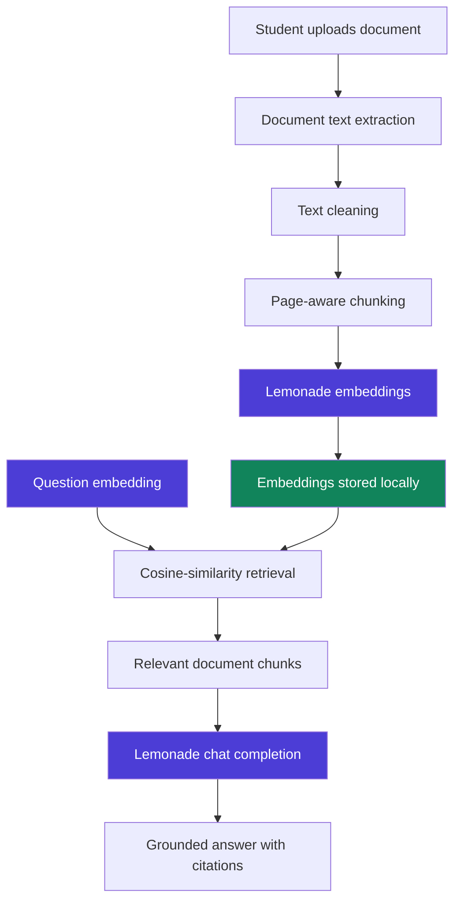

# AI Campus Copilot Local

**A privacy-first student assistant powered by Lemonade local AI**

Upload a college notice, circular, timetable or course PDF. Ask questions about it in
English or Tamil. Get answers grounded in that document, with page citations you can
check — generated entirely by a Lemonade Server running on your own machine.

---

## Attribution — please read first

- This application was created by **Jerome Prakash L** for the **AMD Lemonade Developer Challenge**.
- It **uses Lemonade Server** for all local inference, over Lemonade's public HTTP APIs.
- **Lemonade Server itself is maintained by the Lemonade community and AMD contributors.**
  It is not my work, and nothing here should be read as a claim of authorship over it.
- The repository this folder lives in is a **fork of the official
  [lemonade-sdk/lemonade](https://github.com/lemonade-sdk/lemonade) repository**.
- **My original contribution is only the application inside
  `challenge/ai-campus-copilot-local/`.** The upstream Lemonade source, build system,
  model registry, documentation, licence, copyright notices and Git history are
  unmodified. The single exception is a short pointer section added near the top of the
  root `README.md`.

This project consumes Lemonade Server. It does not duplicate, replace, vendor or
redistribute it.

---

## Why this exists

Indian college notices are dense. A single circular can carry an examination timetable,
a fee deadline, an attendance rule with a condonation exception, and a revaluation
window — all in formal English, often as a scanned-looking PDF dropped into a group
chat. Students miss deadlines because the information is *present* but not *legible*.

Pasting those notices into a cloud chatbot is the obvious fix and a bad one: they carry
roll numbers, fee amounts, eligibility rules and internal contacts. AI Campus Copilot
Local does the same job with nothing leaving the student's machine.

---

## Architecture



Purple stages run on your local Lemonade Server. Green is your browser's IndexedDB.
Everything else runs in the browser tab.

See [`docs/ARCHITECTURE.md`](docs/ARCHITECTURE.md) for the detailed design.

---

## Features

| Page | What it does |
|------|--------------|
| `/setup` | Checks Lemonade, lists **your** installed models, lets you pick a chat model and an embedding model. Never shows a false "connected". |
| `/documents` | Drag-and-drop upload of PDF / TXT / Markdown, page-aware extraction, chunking, embedding with live progress, delete and rebuild. |
| `/chat` | Streaming grounded answers with an expandable panel showing page, chunk number, similarity score and source excerpt. Stop, copy, clear. |
| `/summaries` | Short, detailed, key points, student-friendly, English and Tamil. Long documents are summarised hierarchically. |
| `/deadlines` | Exam, assignment, application, event, fee, scholarship and interview dates as Zod-validated JSON. List, timeline and category views. |
| `/careers` | Internship and placement extraction — organisation, role, eligibility, skills, location, stipend, deadline, link. |
| `/performance` | Genuine measurements only, plus a 5-question benchmark runner with JSON and CSV export. |
| `/privacy` | Exactly where your data goes, plus a live network-activity indicator and a delete-everything button. |

---

## Requirements

- **Lemonade Server**, installed and running — [installation guide](https://lemonade-server.ai/docs/guide/install/)
- **Node.js 20 or newer**
- One **chat model** and one **embedding model** downloaded in Lemonade

No model name is hardcoded. The app discovers what you actually have installed via
`GET /api/v1/models` and filters by capability.

---

## Quick start (Windows 11)

Windows 11 is the primary demonstration environment. The same steps work on Linux and
macOS with the usual shell differences.

### 1. Install and start Lemonade Server

Download and run the installer from
[lemonade-server.ai](https://lemonade-server.ai/docs/guide/install/). On Windows,
`LemonadeServer.exe` starts automatically and shows a tray icon.

### 2. Confirm Lemonade is answering

```powershell
curl http://127.0.0.1:13305/api/v1/health
```

You should see `{"status":"ok","version":"...",...}`.

> The task brief mentions `/v1/health`. Lemonade registers every core endpoint under
> four prefixes — `/api/v0/`, `/api/v1/`, `/v0/` and `/v1/` — so both work. This app
> uses the `/api/v1/` form throughout.

### 3. Install a chat model and an embedding model

```powershell
lemonade list                    # see what is available
lemonade pull <a chat model>     # any text-generation model your PC can run
lemonade pull <an embed model>   # a model labelled "embeddings"
```

Embeddings are supported on the `llamacpp` and `flm` recipes. If you are unsure, open
`/setup` in the app after starting it — it lists exactly which of your installed models
qualify for each role, and tells you what to do if none do.

### 4. Start AI Campus Copilot Local

```powershell
cd challenge\ai-campus-copilot-local
copy .env.example .env.local
npm install
npm run dev
```

### 5. Open the app

Go to <http://localhost:3000>.

### 6. Complete setup

Open **Setup**. Confirm the status reads *Connected*, then choose a chat model and an
embedding model. The badge should change to *Ready to use*.

### 7. Upload a sample document

Open **Documents** and upload `samples/semester-examination-notice.md` (or print it to
PDF first to exercise the PDF path).

### 8. Watch it process

Extraction, chunking and embedding each report real progress and real timings.

### 9. Ask a question

Open **Ask** and try *"When do the end-semester examinations begin?"* — the answer
should cite a page, and the sources panel should show the chunks it used.

---

## Configuration

Copy `.env.example` to `.env.local`:

```env
LEMONADE_SERVER_URL=http://127.0.0.1:13305
NEXT_PUBLIC_APP_NAME=AI Campus Copilot Local
```

`LEMONADE_SERVER_URL` is read **only on the Next.js server** and never reaches the
browser bundle. If your Lemonade Server runs on a different port, change it here.

Set `LEMONADE_API_KEY` only if you started Lemonade with that variable set. A default
local install needs no key.

---

## Scripts

```bash
npm install       # install dependencies
npm run dev       # development server on http://localhost:3000
npm run lint      # ESLint
npm run typecheck # tsc --noEmit, strict mode
npm run test      # Vitest unit tests
npm run test:e2e  # Playwright end-to-end test
npm run build     # production build
npm run check     # lint + typecheck + test + build
```

Playwright needs its browser once per machine: `npx playwright install chromium`.

---

## Lemonade endpoints used

Every shape below was confirmed against the parent repository's own API documentation
(`docs/api/openai.md`, `docs/api/lemonade.md`) and its endpoint tests. None were guessed.

| Endpoint | Used for |
|----------|----------|
| `GET /api/v1/health` | Connection check, server version, loaded models |
| `GET /api/v1/models` | Dynamic model discovery and capability filtering |
| `GET /api/v1/system-info` | OS, processor and memory on the performance page |
| `GET /api/v1/system-stats` | Host resource usage |
| `GET /api/v1/stats` | Tokens/sec and time to first token after a generation |
| `POST /api/v1/embeddings` | Chunk and question embeddings |
| `POST /api/v1/chat/completions` | Grounded answers (SSE streaming), summaries, structured extraction |

---

## Privacy

- Documents are parsed **in your browser**. The file itself is never transmitted.
- Extracted text and your questions travel browser → local Next.js process → local
  Lemonade Server. Every hop is on your machine.
- Chunks, embeddings, chat history, model choices and benchmarks live in this browser's
  IndexedDB (`ai-campus-copilot-local`).
- **No cloud AI provider is used or supported** for the main workflow. There is no
  OpenAI, Anthropic, Google or Voyage AI code path in this project.
- Models may need an initial internet download — that is Lemonade's doing, before you
  use this app.
- No telemetry, no analytics, no remote fonts, no remote scripts.
- Only upload documents you have permission to process.

Full detail in [`docs/PRIVACY.md`](docs/PRIVACY.md) and on the in-app `/privacy` page.

---

## Testing

| Suite | Lemonade Server | Command |
|-------|-----------------|---------|
| Unit (Vitest) | **Mocked** | `npm run test` |
| End-to-end (Playwright) | **Mocked** | `npm run test:e2e` |
| Live-server checklist | **Real**, manual | see [`tests/README.md`](tests/README.md) |

No automated test in this repository talks to a real Lemonade Server. The mocked suites
verify this application's side of the integration — request shape, response parsing,
error classification, retrieval ranking and UI state. They do not measure model quality
and they are not benchmarks. The manual checklist in `tests/README.md` covers what only
a live server can prove.

---

## Known limitations

- **Scanned PDFs are not supported.** Extraction is text-layer only. Pages with no text
  are detected and reported, and the app tells you OCR would be required rather than
  silently returning nothing. Tesseract.js integration is a natural next step.
- **Answer quality tracks your model.** A 0.6B model on CPU will be noticeably weaker
  than a 7B model on an NPU or GPU. The grounding, citation and refusal behaviour is the
  app's contribution; fluency is the model's.
- **Tamil output depends on the model.** The prompt requests Tamil and the UI font stack
  includes a Tamil face, but a model with weak Tamil coverage will produce weak Tamil.
- **Structured extraction is best-effort.** Sections whose JSON fails Zod validation are
  counted and skipped, never silently repaired — the count is shown in the UI.
- **Retrieval is single-document.** Cross-document search is not implemented.
- **The relevance threshold is a fixed constant** (0.2 cosine). Embedding models differ
  in score distribution; a per-model calibration would be better.
- **No published benchmark numbers.** The performance page reports what it measures on
  your hardware. I have not run a controlled comparison across devices, so this project
  claims no throughput figures.

---

## Licence

Apache-2.0 — see [`LICENSE`](LICENSE), matching the parent repository.

Copyright 2027 Jerome Prakash L, for the contents of
`challenge/ai-campus-copilot-local/` only.

Lemonade Server is copyright the Lemonade Community and AMD contributors, licensed
Apache-2.0. Its notices are preserved unmodified in the repository root `LICENSE`.

---

*Powered by Lemonade local AI.*
