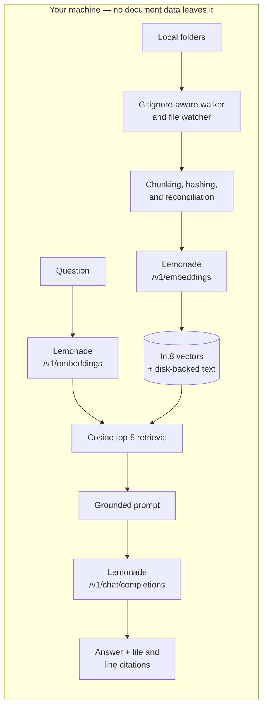

# Context-Lemon

[](https://github.com/Kenneth-Aidan-B/Context-Lemon/actions/workflows/ci.yml)
[](LICENSE)
[](#quick-start)
[](#privacy-boundary)

**Give Lemonade private memory over your local files.**

Context-Lemon is a lightweight, fully local, folder-aware RAG and memory layer for
[AMD Lemonade](https://lemonade-server.ai/). It continuously indexes local files and
produces grounded answers with file-and-line citations—without sending documents to
the cloud.

> **The citation is the product.** An answer you cannot trace back to the source is
> not useful.

## Built for the AMD x Lemonade Developer Challenge

Context-Lemon turns Lemonade's OpenAI-compatible local inference API into a usable
desktop knowledge workflow. It calls both `/v1/embeddings` and
`/v1/chat/completions`; the application owns the file watching, incremental indexing,
retrieval, prompt grounding, and citations around those calls.

| Challenge dimension | What Context-Lemon demonstrates |
| --- | --- |
| Community impact | Private document Q&A that works without API keys, a cloud vector database, or uploading files |
| Technical depth | Rust/Tauri, int8 embeddings, disk-backed chunk text, crash-safe persistence, cancellation, and model compatibility checks |
| Creativity | A continuously updated memory layer for arbitrary local folders with exact file-and-line citations |
| Open source | MIT-licensed source, reproducible builds, tests, and CI |

The project targets the
[AMD x Lemonade Developer Challenge](https://www.amd.com/en/developer/resources/technical-articles/2026/join-the-lemonade-developer-challenge.html).

## Quick start

### Prerequisites

- Windows 10 or 11
- [Lemonade Server](https://lemonade-server.ai/)

Install and start Lemonade Server, then pull the two models used by Context-Lemon:

```powershell
lemonade pull nomic-embed-text-v1-GGUF
lemonade pull Qwen3-0.6B-GGUF
```

Download the latest Windows executable from
[Context-Lemon v0.2.0](https://github.com/Kenneth-Aidan-B/Context-Lemon/releases/tag/v0.2.0)
and launch it. The current executable is unsigned, so Windows may display a
SmartScreen warning. Lemonade Server and the models are installed separately and are
not bundled with the application.

To run from source instead, see [Build from source](#build-from-source).

### Try the bundled demo

The first launch registers and indexes the four-file **Project Nightingale** sample
automatically. Ask:

> What port does the Nightingale gateway listen on by default?

The expected answer is port `7913`, with `sample/faq.md` ranked among the citations.
This is a real quality-test case, not a hard-coded response.

## Supported files and limits

Context-Lemon currently indexes UTF-8 text files with the following extensions:

`md`, `markdown`, `txt`, `rst`, `json`, `yaml`, `yml`, `toml`, `rs`, `py`, `js`,
`jsx`, `ts`, `tsx`, `go`, `java`, `c`, `h`, `cpp`, `hpp`, `cs`, `rb`, `php`,
`html`, `css`, `scss`, `sh`, `ps1`, `sql`, and `xml`.

### Current limits

- Maximum indexed file size: **5 MiB per file**
- Binary, unreadable, and non-UTF-8 files are skipped
- `.gitignore`, global Git ignore rules, and repository exclude rules are respected
- Common dependency, build, and editor directories are excluded, including `.git`,
  `node_modules`, `target`, `dist`, `build`, `.next`, `vendor`, `__pycache__`,
  `.venv`, `venv`, `.idea`, and `.vscode`
- PDF, DOCX, PPTX, XLSX, image, audio, and video ingestion is not supported
- Files are indexed incrementally; unchanged content is not re-embedded
- Changes inside watched folders trigger automatic re-indexing after a short debounce
- Chunking targets approximately 1,400 characters with about 250 characters of
  overlap; long lines and oversized embedding inputs are split automatically

## Architecture



Both model calls go to Lemonade. Context-Lemon does not call a hosted model, cloud
embedding API, or remote vector database.

## Why the engineering matters

- **Incremental.** Re-indexing uses stable FNV-1a content hashes and skips unchanged
  files, including files whose timestamps changed but bytes did not.
- **Reconciling.** Deleted, renamed, newly ignored, oversized, or unreadable files are
  purged so stale content cannot be cited.
- **Crash-safe.** The index is written to a temporary file, synced, and renamed. A
  failed load preserves the old data as `index.bin.corrupt` for diagnosis.
- **Cancellable.** Removing a folder cancels in-flight work, with a second check under
  the store lock so cancelled jobs cannot repopulate purged data.
- **Model-aware.** The index records the embedding model and resets when the model
  changes, preventing retrieval across incompatible vector spaces.
- **Resilient to dense files.** Oversized embedding inputs are isolated, split at
  UTF-8-safe boundaries, and retried without failing the rest of the batch.
- **Resilient to transient failures.** A dropped local connection is retried with
  backoff rather than aborting an entire folder's indexing run, while HTTP and model
  errors still surface immediately.
- **Batched across files.** Embedding requests are filled from a bounded window of
  chunks spanning many files, so a corpus of small files still produces full-sized
  batches instead of one near-empty request per file.
- **Live.** File events are filtered and debounced for 1.5 seconds before automatic
  re-indexing.
- **Repository-aware.** `.gitignore`, `node_modules`, `.git`, build output, binaries,
  and files larger than 5 MB are excluded.

## Memory footprint

The design goal is a RAG layer small enough to leave running all day.

| Representation | Per chunk | At 50,000 chunks |
| --- | ---: | ---: |
| Naive f32 vectors plus heap text | ~5 KB | ~265 MB |
| **Context-Lemon** | **917 B** | **~44 MB** |

Embeddings are unit-normalized, rescaled so their largest component maps to ±127, and
stored as int8. This reduces a 768-dimensional vector from 3,072 bytes to 768 bytes.
Chunk text lives in an append-only, generation-numbered disk blob and is read only for
the retrieved top-k results.

The `quantization_preserves_ranking_and_score` test compares int8 retrieval with exact
f32 cosine similarity across 200 vectors. It requires the same top-1 result, the same
top-5 set, and scores within `0.01`.

## Indexing performance

Measured on the reference development machine in a release build, over a synthetic
corpus of small Markdown files — the shape a source repository or a notes folder takes.

| Workload | Result | Time |
| --- | --- | ---: |
| Cold index | 10,000 files → 10,000 chunks | 46.75 s |
| Unchanged rescan | 10,000 files skipped, 0 embeddings regenerated | 3.47 s |
| 1% modified | 100 files re-embedded, 9,900 skipped | 4.09 s |

Cold indexing sustains roughly 214 files/s. Throughput is flat between 5,000 and 10,000
files, so cost scales linearly with corpus size rather than degrading as the index grows.

Where that time goes at 10,000 files:

| Stage | Share of cold-index time |
| --- | ---: |
| Lemonade embedding | ~90% |
| Local persistence (int8 store and periodic flush) | ~6% |
| Filesystem traversal, reads, and content hashing | ~4% |

Approximately 90% of cold-indexing time is spent in Lemonade embedding, while
filesystem, hashing, and persistence together account for approximately 10%.
Application-side work is therefore not the dominant cost: the workload is bounded by
local inference throughput, which is what changes across CPU, GPU, and NPU backends.

These figures are reproducible rather than asserted. The benchmarks ship in the test
suite, marked `#[ignore]` so they never run in CI, and write only to temporary
directories:

```powershell
cd src-tauri
cargo test --release --test bench_scaling --locked -- --ignored --nocapture
cargo test --release --test bench_decompose --locked -- --ignored --nocapture
```

`bench_scaling` covers cold-index scaling at 1,000/5,000/10,000 files and the
incremental cases above; `bench_decompose` separates Lemonade embedding cost from
local persistence cost. Both require a running Lemonade Server. Release builds matter
here: an unoptimized build inflates local persistence cost by roughly 60x and makes it
look like the bottleneck, which it is not.

## Grounding and quality tests

The live quality suite tests behavior rather than merely checking that the model
returned text:

- attribution to the document containing a known fact;
- synthesis across two different documents;
- refusal when the answer is absent from the corpus;
- rejection of plausible but incorrect default values; and
- a known-answer query with non-empty citations.

Run the deterministic unit suite:

```powershell
cd src-tauri
cargo test --lib --locked
```

With Lemonade running, run the live RAG suites. Each suite builds a disposable index
from the bundled sample, so it never reads or modifies the user's application index:

```powershell
cargo test --test rag_smoke --locked -- --nocapture
cargo test --test rag_quality --locked -- --nocapture
```

The live suites skip when Lemonade is unavailable, so CI runs the deterministic
library suite. When Lemonade is reachable, indexing or model failures fail the test.
The Windows CI workflow also type-checks and builds the frontend with `npm run build`.

## Privacy boundary

All indexed content stays on the local machine. Context-Lemon sends embeddings and
chat requests only to the configured Lemonade Server URL, which defaults to
`http://localhost:13305/v1`. Models and Lemonade Server are installed separately and
are not redistributed by this repository.

Local state is stored under:

```text
%APPDATA%\lemonade-context-engine\
  config.json           watched folders + Lemonade URL
  index.bin             metadata + int8 vectors (format v3)
  chunks.<gen>.dat      chunk text, read on demand
  index.bin.corrupt     preserved failed index, if one occurs
```

## Hardware

Context-Lemon contains no device-specific inference code. Lemonade selects its own
CPU, GPU, or NPU backend; the application uses the same local HTTP API in every case.
The default 4-bit `Qwen3-0.6B-GGUF` model was chosen to remain useful on CPU-only
machines.

Reference development benchmark:

| Spec | Result |
| --- | --- |
| RAM | 16 GB |
| GPU | NVIDIA RTX 3050 6 GB laptop, selected by Lemonade |
| NPU | None |
| Generation | 213–215 tok/s |
| Time to first token | 39–62 ms |

These figures describe the development machine and are not presented as AMD hardware
results. Actual performance depends on the model, Lemonade backend, and device.

## Build from source

Source builds require Node.js 20 or newer, the stable Rust toolchain, and
[Tauri's Windows prerequisites](https://v2.tauri.app/start/prerequisites/).

```powershell
git clone https://github.com/Kenneth-Aidan-B/Context-Lemon.git
cd Context-Lemon
npm ci
npm run build
npm run tauri dev
```

Create an optimized production build with:

```powershell
npm run tauri build -- --no-bundle
```

The production executable is written to
`src-tauri/target/release/lemonade-context-engine.exe`; `Context-Lemon` is the
user-facing application and bundle name.

## Release status

Version `0.2.0` adds cross-file embedding batching, live indexing progress in the UI
(files scanned, files remaining, and chunks embedded), retry on transient local
connection failures, and the reproducible indexing benchmarks documented above.

Version `0.1.0` established the tray application, folder registration, first-run sample,
gitignore-aware walking, overlap chunking, int8 disk-backed storage, incremental and
reconciling indexing, live file watching, retrieval, grounded generation, file-and-line
citations, deterministic unit tests, live RAG quality tests, and Windows CI.

The downloadable Windows executable is an unsigned standalone build. Source builds
remain fully reproducible using the commands above.

## License

Context-Lemon is MIT licensed; see [LICENSE](LICENSE). Direct and transitive dependency
licenses are documented in [THIRD_PARTY.md](THIRD_PARTY.md).

The bundled `sample/` corpus is original fiction created for this project. “Project
Nightingale” and “Aeroflux Systems” are not real organizations.
