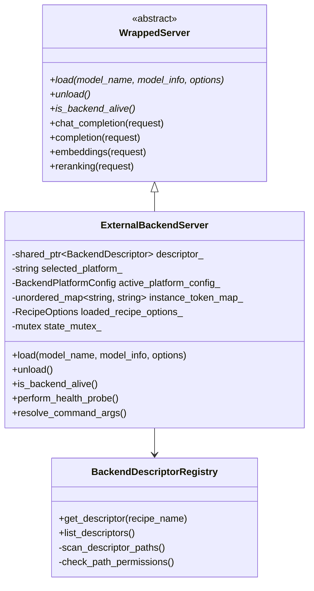
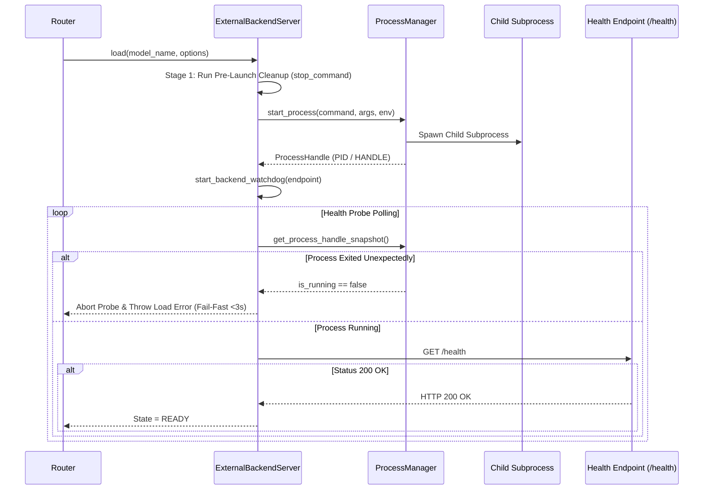

# Custom Backends Technical Specification & Architecture

This document specifies the internal technical design, security model, string resolution engine, process handle supervision, and invariant enforcement for the **Dynamic Custom Backend System** in Lemonade.

---

## 1. Architectural Overview

The dynamic custom backend system allows Lemonade to register, load, supervise, and unload out-of-process external inference engines declared via JSON descriptors.

### Class Hierarchy

---

## 2. Descriptor Discovery & POSIX Security Rules

`BackendDescriptorRegistry` ([src/cpp/server/backends/backend_descriptor_registry.cpp](../../src/cpp/server/backends/backend_descriptor_registry.cpp)) scans search paths in strict priority order guarded by a `std::mutex`:

1. **User Config Path**: `$XDG_CONFIG_HOME/lemonade/backends/` (`~/.config/lemonade/backends/`) or `%APPDATA%\Lemonade\backends\`
2. **User Cache Path**: `~/.cache/lemonade/backends/` or `%USERPROFILE%\.cache\lemonade\backends\`
3. **System Distribution Paths**: `/usr/share/lemonade-server/backends/`, `/usr/local/share/lemonade-server/backends/`, `/Library/Application Support/Lemonade/backends/`, `/etc/lemonade/backends/`, or `%ProgramData%\Lemonade\backends\`

### Security Rules Validation Algorithm (`check_path_permissions`)

To prevent local privilege escalation or arbitrary code execution via tampered descriptors:
- **POSIX**:
  - System distribution directories and files must be owned by `root` (UID 0).
  - User directories and descriptor files must be owned by the running process's effective UID (`geteuid()`).
  - Mode bits must satisfy `(st_mode & 0022) == 0`. Group-write and world-write permissions are rejected.
  - Ancestor directory walks allow shared temporary directories (such as `/tmp`) if they are owned by the user or have the sticky bit (`S_ISVTX`) set.
- **Windows**:
  - Validates security descriptors using `GetNamedSecurityInfoW`. Write permissions assigned to `WinWorldSid` (Everyone) or `WinBuiltinUsersSid` (Users) are strictly rejected.

---

## 3. String Interpolation & Token Resolution Engine

The core argument parsing logic resides in `ExternalBackendServer::resolve_command_args()` ([src/cpp/server/backends/external/external_backend_server.cpp](../../src/cpp/server/backends/external/external_backend_server.cpp)).

### Resolution Steps
1. **Builtin Token Replacement**:
   Replaces placeholders such as `{port}`, `{host}`, `{recipe}`, `{model_name}`, `{resolved_path}`, `{hf_cache}`, `{cuda_visible_devices}`, `{hip_visible_devices}`, and `{ggml_vk_visible_devices}`.
2. **Checkpoint Relative Map**:
   Replaces `{checkpoint_relative:<name>}` with the relative snapshot blob path mapped in `user_models.json`.
3. **Environment Variable Expansion (`{env:VAR:-default}`)**:
   Reads `VAR` from system environment; if empty or unset, substitutes `default`.
4. **Custom Option Expansion (`{custom:opt:-default}`)**:
   Reads option `opt` from `RecipeOptions`; if missing, substitutes `default`.
5. **Custom Argument Tokenization (`{custom_args}`)**:
   Inspects `recipe_options.get_option("args")`. If a JSON array is provided (`["--flag", "val"]`), each element is appended as a distinct argument token. If a string is provided, arguments are tokenized using `lemon::utils::parse_custom_args()` (handling shell quotes and escape characters).
6. **Character Whitelisting**:
   Token values are verified against a character whitelist (`isalnum`, `_`, `-`, `:`, `.`, `/`, `=`, `,`, quotes, spaces) to prevent shell command injection.

---

## 4. Process Supervision & Health Probing

### Fail-Fast Liveness Checks
Inside `perform_health_probe()`, the polling loop checks `get_process_handle_snapshot()` on every iteration. If the child process crashes or terminates early (e.g. invalid arguments or bad GPU kernel initialization), the probe loop breaks immediately with log message `Subprocess died unexpectedly during health probe`, returning control to `Router` in <3 seconds instead of blocking for the full timeout duration.

---

## 5. Two-Stage Teardown & Handle Cleanup Invariants

When `unload()` is invoked:
1. `stop_backend_watchdog()` halts HTTP health monitoring.
2. **Stage 1 (Custom Stop Command)**:
   If `stop_command` is configured (e.g. `podman rm -f -t 0 lemonade-{recipe}-{port}`), Lemonade evaluates tokens in `stop_command_args` under `state_mutex_` snapshot and executes the command via `ProcessManager::run_command`.
3. **Stage 2 (OS Process Handle Teardown)**:
   If `has_process_handle(handle)` returns `true`, Lemonade invokes `ProcessManager::stop_process(handle)`. On POSIX systems, `stop_process` sends `SIGTERM`, waits up to 5s, sends `SIGKILL`, and reaps the child process via `waitpid` to prevent zombie `[defunct]` processes. On Windows, it invokes `TerminateProcess` and closes the handle via `CloseHandle`.

---

## 6. Critical Project Invariant Compliance

1. **Quad-Prefix Endpoints**: `ExternalBackendServer` forwards HTTP capability payloads directly to `/v1/*` endpoints on the backend port, preserving Lemonade's quad-prefix handlers (`/api/v0/`, `/api/v1/`, `/v0/`, `/v1/`) in `server.cpp`.
2. **Invariant 11 (Config Precedence)**: Explicit `RecipeOptions` take precedence over environment variables during token resolution.
3. **WrappedServer Subprocess Model**: Dynamic backends execute strictly as out-of-process subprocesses managed by `ProcessManager`.
4. **NPU Exclusivity**: `ExternalBackendServer::effective_slot_policy()` exposes the descriptor's `slot_policy` (`ExclusiveNpu`, `CoexistByType`, `Unmetered`, or `Standard`), enabling `Router` to enforce hardware exclusivity automatically.
