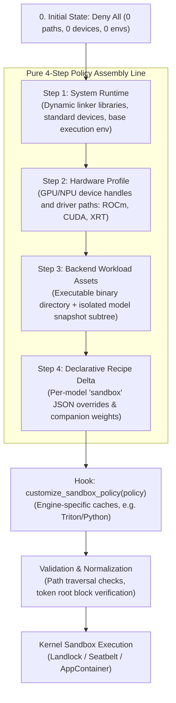

# Backend Sandboxing & Capability Architecture

This document covers the architectural implementation of process sandboxing, capability confinement, and credential scrubbing in Lemonade for backend engine developers.

---

## The 4-Step Assembly Line Architecture

Lemonade follows a strict **zero-privilege, additive capability pipeline** when constructing a sandbox policy. A policy starts with 0 allowed paths, 0 allowed devices, 0 allowed environment variables, and `LoopbackOnly` network access.



---

## Implicit Backend Spawning

For standard backends (such as `Kokoro`, `Whisper`, `SdServer`, `LlamaCpp`, etc.), policy construction is **completely implicit**.

A backend subclass only calls `start_backend_process(...)`:

```cpp
void MyBackendServer::load(...) {
    // 1. Resolve arguments and flags
    std::vector<std::string> args = { "--model", model_path, "--port", std::to_string(port_) };

    // 2. Launch process (automatically builds 4-step policy, validates, and scrubs environment)
    set_process_handle(start_backend_process(executable_path, args));

    // 3. Wait for readiness
    if (!wait_for_ready("/health")) {
        unload();
        throw std::runtime_error("Backend failed to start");
    }
}
```

---

## Customizing Policies in Subclasses

When a backend requires unique compilation caches or runtime environment variables (for example, `vLLM` compiling Triton kernels or requiring Python site packages), the backend subclass overrides the `customize_sandbox_policy` virtual hook:

```cpp
void VLLMServer::customize_sandbox_policy(lemon::sandbox::SandboxPolicy& policy) const {
    // Allow engine-specific compiler caches
    const char* home = std::getenv("HOME");
    if (home) {
        std::filesystem::path h(home);
        policy.add_write_path((h / ".cache" / "vllm").string());
        policy.add_write_path((h / ".cache" / "triton").string());
        policy.add_write_path((h / ".cache" / "miopen").string());
    }

    // Allow Python runtime execution variables
    policy.allow_env_vars({
        "PYTHONPATH", "PYTHONHOME", "VIRTUAL_ENV",
        "VLLM_USAGE_SOURCE", "FLASH_ATTENTION_TRITON_AMD_ENABLE", "PYTHONNOUSERSITE"
    });
}
```

---

## Snapshot & Token Root Protection Invariant

A critical security invariant enforced by `validate_policy()` is that backend processes must never be granted access to parent cache roots where user tokens reside.

* **Allowed**: `/home/user/.cache/huggingface/hub/models--org--repo/snapshots/hash/`
* **Prohibited**: `/home/user/.cache/huggingface/token` or `/home/user/.cache/huggingface` root directly.

If a recipe or backend attempts to grant access to a prohibited credential directory, `validate_policy()` rejects the policy with a fatal configuration error before process launch.

---

## Platform Containment Internals

### Linux (Landlock LSM + Seccomp)
1. **In-Child Confinement**: Policy rules are applied inside the forked child process between `fork()` and `execve()`.
2. **Path Normalization**: All paths are resolved to lexical canonical form.
3. **No New Privileges**: `prctl(PR_SET_NO_NEW_PRIVS, 1, ...)` is enforced before applying the Landlock ruleset.
4. **Seccomp Egress Blocking**: When network access is `DenyAll` or `LoopbackOnly`, seccomp filters intercept outbound connection attempts.

### macOS (Apple Seatbelt)
1. **SBPL Compilation**: Generates a dynamic Seatbelt Sandbox Profile Language string.
2. **Positive Allowlist**: Grants access only to essential system libraries (`/System/Library`, `/usr/lib`) and declared file grants.
3. **`sandbox_init`**: Applied in-child prior to `execve()`.

### Windows (AppContainer & Job Objects)
1. **AppContainer SIDs**: Derives unique AppContainer SIDs per model session.
2. **Access Control Entries (ACEs)**: Applies transient `GENERIC_READ` and `GENERIC_WRITE` ACEs exclusively to declared paths.
3. **Job Objects**: Assigns child processes to a Job Object configured with `JOB_OBJECT_LIMIT_KILL_ON_JOB_CLOSE`.

---

## Testing Sandboxed Backends

Sandbox unit tests live in `test/cpp/` and are prefixed with `test_sandbox_*`:

| Test Target | Suite | Focus |
| :--- | :--- | :--- |
| `test_sandbox_policy` | `SandboxPolicyTest` | 4-step assembly, JSON schema round-trip, policy validation |
| `test_sandbox_engine` | `SandboxEngineTest` | Engine lifecycle, mode transitions, auto-detection |
| `test_sandbox_env_scrubber` | `SandboxEnvScrubberTest` | Zero-privilege default allowlists, secret pattern scrubbing |
| `test_sandbox_env_scrubber_confinement` | `SandboxEnvScrubberConfinementTest` | Active secret poisoning, token stripping, process isolation |
| `test_sandbox_process` | `SandboxProcessTest` | Landlock / Seatbelt network egress blocking, loopback ports |
| `test_sandbox_wrapped_server` | `SandboxWrappedServerTest` | Hardware profiles, variants, declarative recipe deltas |
| `test_sandbox_backend_confinement` | `SandboxBackendConfinementTest` | Real backend subprocess execution under confinement |
| `test_sandbox_windows` | `SandboxWindowsTest` | Windows AppContainer SIDs and Job Object limits |

Run the full CI test suite with:
```bash
cmake --build --preset default --target cpp-ci-tests
ctest --test-dir build -L cpp-ci --output-on-failure
```
