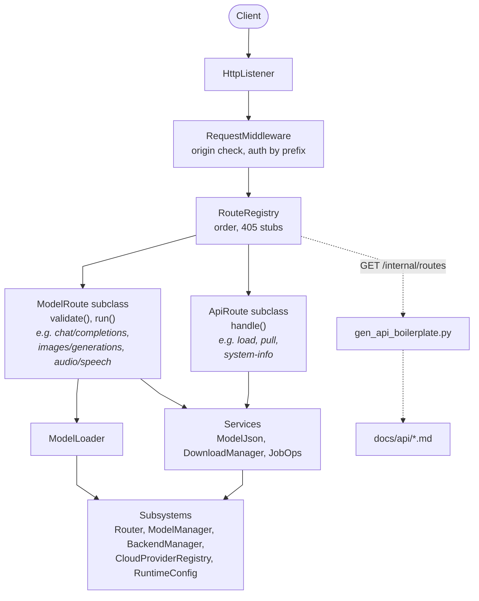

# HTTP Server Spec

- [Summary](#summary)
- [Scope](#scope)
- [Architecture](#architecture)
- [Route Base Classes](#route-base-classes)
- [Route Folders](#route-folders)
- [Core Components](#core-components)
- [Generated Docs](#generated-docs)
- [Appendix A: PR History](#appendix-a-pr-history)
- [Appendix B: Error Format Cleanup](#appendix-b-error-format-cleanup)

## Summary

This spec defines how lemond's HTTP server is organized into route classes, core components and services, and how its API docs are generated from the routes.

The goal is that server PRs are narrowly scoped, easy to author, and easy to review:

- **Narrow.** Changing an endpoint edits one route file. Adding an endpoint adds one file and one registration line in its folder.
- **Easy to author.** Each route's folder matches its docs page, and its docs metadata sits in the same class as its handler.
- **Easy to review.** The base class enforces URL prefixes, auth and 405 handling, and every API change shows up as a diff in the generated docs.

[Appendix A](#appendix-a-pr-history) has the PR history these goals are drawn from.

## Scope

This section lists what the design covers.

- **Compatibility.** The design preserves the public API: URLs, auth, request and response bodies, error shapes and status codes. [Appendix B](#appendix-b-error-format-cleanup) describes unifying error shapes.
- **Routes covered.** Every HTTP route lemond serves, including the Ollama, Anthropic and MCP gateways.
- **Not covered.** The WebSocket APIs (`/realtime`, `/logs/stream`) are not httplib routes, and their docs are hand-written. The MCP tool reference is generated by `gen_mcp_boilerplate.py`.
- **Tests.** End-to-end integration tests cover the routes, and the drift check in [Generated Docs](#generated-docs) covers the docs.

## Architecture

This section shows how a request reaches a route, and how the same routes produce the docs.



`Server` is the composition root: it builds a `ServerContext`, registers every route folder with the `RouteRegistry`, and starts and stops the core components in order. A route writes only its handler; its base class does the shared work, described in [Route Base Classes](#route-base-classes).

## Route Base Classes

This section defines the two base classes every route extends, the `RouteSpec` each route declares, and the helpers routes share.

```cpp
enum class Prefixes { Quad, Internal, Root };      // URLs and auth; see Prefixes below
enum class ArgIn { JsonBody, Query, Path, Form };  // where an argument comes from
enum class RequestFormat { Raw, Json, OptionalJson, Form };  // how the base class parses the request body

// Clients parse each kind of body differently, and some stream.
enum class ResponseFormat {
    Json,          // one JSON body
    JsonLines,     // newline-delimited JSON objects, streamed (application/x-ndjson)
    EventStream,   // server-sent events with JSON data, streamed (text/event-stream)
    Text,          // e.g. Prometheus metrics, markdown, a transcript
    Binary,        // e.g. audio, a glTF mesh
    BinaryStream,  // binary, streamed as generated, e.g. speech
    Empty,         // e.g. the 202 answering an MCP notification
};

struct RouteArg {
    std::string name;
    ArgIn in;
    nlohmann::json schema;            // JSON-schema subset
    bool required = false;
    bool supported = true;            // false documents it as not available
    std::string description;
};

// Some examples require lemond to be in a certain state, for example unload requires a loaded
// model. ExampleRef allows one example to take a dependence on another to achieve that state.
struct ExampleRef {
    std::string route;                // RouteSpec::id
    ResponseFormat format;            // selects which of the route's examples
};

// Each format a route returns gets its own schema and example in the docs.
struct RouteResponse {
    ResponseFormat format;

    // JSON formats only. JSON Schema for the body, each NDJSON line, or each SSE event's data;
    // --check validates against it. A format with several shapes, such as /load's three, uses oneOf.
    nlohmann::json schema;

    // Examples to run first, in order, when generating the documentation. Examples can reference
    // their dependences' responses, for example {"id": "$lemonade.jobs_create/id"}.
    std::vector<ExampleRef> setup;

    // A request producing this format; gen_api_boilerplate.py records its response into the docs
    // and --check validates it.
    nlohmann::json example;
};

struct RouteSpec {
    std::string id;                   // "<page>.<name>", e.g. "openai.chat_completions"; docs anchor
    std::vector<std::string> methods; // e.g. {"POST"}
    std::vector<std::string> paths;   // without prefix; extra entries are aliases, e.g. rerank, reranking
    Prefixes prefixes = Prefixes::Quad;
    std::string summary;              // one line in the page's summary table
    std::string description;          // reference text for the route's docs section
    std::vector<std::string> notes;
    std::vector<RouteArg> args;       // every argument, documented whether or not validated
    std::vector<RouteResponse> responses;  // one per format; empty for an unsupported route, e.g. Ollama's POST /api/create (501)
    RequestFormat request_format = RequestFormat::Raw;  // Raw: no parsing; OptionalJson: an empty body is {}
    bool model_defaults_to_loaded = false;  // ModelRoute only; see ModelRoute below
    bool validate_args = false;       // check args with McpTool's validator; off for pass-through routes
    bool quiet_log = false;           // leave out of the access log
};

class ApiRoute {
public:
    explicit ApiRoute(ServerContext& ctx) : ctx_(ctx) {}
    virtual ~ApiRoute() = default;
    virtual RouteSpec spec() const = 0;
    virtual void handle(RouteRequest& req, httplib::Response& res) = 0;
protected:
    ServerContext& ctx_;
};

class ModelRoute : public ApiRoute {
public:
    using ApiRoute::ApiRoute;
    void handle(RouteRequest& req, httplib::Response& res) final;  // resolve, validate, load, run
protected:
    virtual bool validate(RouteRequest& req, httplib::Response& res) { return true; }
    virtual void run(RouteRequest& req, httplib::Response& res) = 0;
};
```

### Prefixes

The prefix policy sets a route's URLs and the key its requests need, enforced in `Server::authenticate_request()`:

| Policy | URLs | Auth |
| --- | --- | --- |
| `Quad` | `/api/v0/`, `/api/v1/`, `/v0/` and `/v1/` plus each path (Invariant #10). A POST-only path also gets a GET route that answers 405 | `LEMONADE_API_KEY` |
| `Internal` | `/internal/` plus each path | `LEMONADE_ADMIN_API_KEY` |
| `Root` | Each path as written, such as `/live`, `/metrics`, `/mcp` and Ollama's `/api/*` | By path: `/metrics`, `/mcp` and `/api/*` need `LEMONADE_API_KEY`; `/live` needs none |

### `ModelRoute`

`ModelRoute` is the base for routes that run a model: chat, completions, responses, embeddings, rerank, classify, images, transcription, speech, audio generation and 3D generation. Its `handle()` is final and runs these steps:

1. Builds `req.body`. For a `RequestFormat::Form` route, it copies each `ArgIn::Form` text field into `req.body`, converted to the arg's schema type, and answers 400 when a value does not convert. File parts stay on the httplib request. Registration rejects a `ModelRoute` whose `request_format` is `Raw`, since step 2 reads the model from `req.body`.
2. Resolves the model name.
3. Calls `validate()`. Returning false means `validate()` already wrote the response.
4. Requires a model. With no `model` in the request, it answers 400, unless the route sets `model_defaults_to_loaded` and a model is loaded, in which case that model serves the request.
5. Auto-loads the model through `ModelLoader`. On failure it writes the `create_model_error` response, the same shape for every model route.
6. Calls `run()`.

OpenAI requires `model` on every route `ModelRoute` serves. `model_defaults_to_loaded` is a Lemonade extension, set only on chat/completions, completions, embeddings and responses, and those routes document `model` as optional.

`validate()` runs before any load, so it can reject a bad request without loading a model (speech's model-type check, 3D's image check), attach uploaded files in the shape its backend expects (transcription's raw `file`, images/edits' base64 `image` and `mask`), fill in a missing model (classify picks the single loaded classifier), rewrite the model (router collections), or answer the request itself (Omni collections, which load their own components).

Every other route extends `ApiRoute` directly.

### Request and Context

`RouteRequest` holds one request's data: the httplib request, the parsed request body unless `request_format` is `Raw`, the resolved model name, and the router decision when there is one.

`ServerContext` holds pointers to the subsystems (`Router`, `ModelManager`, `BackendManager`, `CloudProviderRegistry`, `AliasManager`, `RuntimeConfig`), to `HttpListener`, and to the services in [Core Components](#core-components). It holds no state of its own. Everything it points to lives as long as lemond, so it has no `WebSocketServer` pointer: a `host` or `websocket_port` change replaces that server, and `/health` reads its port from `HttpListener::websocket_port()`.

Route objects are built once at startup and serve concurrent requests, so they hold no per-request state (Invariant #7).

### Shared Helpers

Routes call these helpers from their own code, so the flow stays visible in the route file:

| Helper | Purpose |
| --- | --- |
| `ApiRoute::stream_response()` | The only way a route streams. Wraps httplib's chunked content provider, sets the SSE headers, and carries the cancel token and telemetry span into the stream, since they must outlive `handle()` |
| `cancel_on_disconnect()` | Aborts the upstream backend request when the client disconnects during a non-streaming request (Invariant #11) |
| `router_dispatch()` | Runs `collection.router` policies and returns the decision; lives in `routes/router/` |
| `attach_route_decision()` | Adds the router decision to the response body and headers |
| `record_usage()` | Records token usage and timings for telemetry |
| `set_error_response()` | Maps a backend error body to its HTTP status |

### Response Schemas

This section defines where the schemas in `RouteResponse` come from:

- **In the route class.** Response schemas are JSON Schema, written next to the route's `RouteArg` schemas, so a route's whole contract sits beside its handler. `gen_api_boilerplate.py` reads them from `GET /internal/routes` with the rest of the `RouteSpec`.
- **Shared shapes.** A shape that more than one route returns has a schema function declared beside the function that builds it, such as `ModelJson::schema()` beside `ModelJson::to_json()`, so the shape and its schema change together.
- **Pass-through routes.** The schema describes the public contract the route follows, such as OpenAI's chat completion object, limited to the fields Lemonade returns.

`route_decision_schema()`, declared beside `route_decision_to_json()` in `lemon/route_decision_response.h`, returns the schema the routing engine already maintains:

```cpp
nlohmann::json route_decision_schema() {
    std::ifstream file(utils::get_resource_path("resources/schemas/decision.schema.json"));
    return nlohmann::json::parse(file);
}
```

### Complete Example

`routes/openai/text/chat_completions.cpp`:

```cpp
nlohmann::json chat_completion_schema() {
    auto schema = nlohmann::json::parse(R"({
        "type": "object",
        "required": ["id", "object", "created", "model", "choices", "usage"],
        "properties": {
            "id": {"type": "string"},
            "object": {"const": "chat.completion"},
            "created": {"type": "integer"},
            "model": {"type": "string"},
            "choices": {"type": "array", "items": {
                "type": "object",
                "required": ["index", "message", "finish_reason"],
                "properties": {
                    "index": {"type": "integer"},
                    "message": {
                        "type": "object",
                        "required": ["role", "content"],
                        "properties": {
                            "role": {"const": "assistant"},
                            "content": {"type": ["string", "null"]}
                        }
                    },
                    "finish_reason": {"type": "string"}
                }
            }},
            "usage": {
                "type": "object",
                "required": ["prompt_tokens", "completion_tokens", "total_tokens"],
                "properties": {
                    "prompt_tokens": {"type": "integer"},
                    "completion_tokens": {"type": "integer"},
                    "total_tokens": {"type": "integer"}
                }
            }
        }
    })");
    // Router collections add their routing decision to the response.
    schema["properties"]["x_lemonade_route"] = route_decision_schema();
    return schema;
}

nlohmann::json chat_completion_chunk_schema() {
    return nlohmann::json::parse(R"({
        "type": "object",
        "required": ["id", "object", "created", "model", "choices"],
        "properties": {
            "id": {"type": "string"},
            "object": {"const": "chat.completion.chunk"},
            "created": {"type": "integer"},
            "model": {"type": "string"},
            "choices": {"type": "array", "items": {
                "type": "object",
                "required": ["index", "delta", "finish_reason"],
                "properties": {
                    "index": {"type": "integer"},
                    "delta": {
                        "type": "object",
                        "properties": {
                            "role": {"const": "assistant"},
                            "content": {"type": ["string", "null"]}
                        }
                    },
                    "finish_reason": {"type": ["string", "null"]}
                }
            }}
        }
    })");
}

class ChatCompletionsRoute : public ModelRoute {
public:
    using ModelRoute::ModelRoute;

    RouteSpec spec() const override {
        RouteSpec s;
        s.id = "openai.chat_completions";
        s.methods = {"POST"};
        s.paths = {"chat/completions"};
        s.prefixes = Prefixes::Quad;
        s.summary = "Chat Completions";
        s.description = "Generates the next assistant message for a conversation.";
        s.args = {
            {"model", ArgIn::JsonBody, {{"type", "string"}}, false, true, "Model to run; loaded on first use. Defaults to the loaded model."},
            {"messages", ArgIn::JsonBody, {{"type", "array"}}, true, true, "Conversation in OpenAI format."},
            {"stream", ArgIn::JsonBody, {{"type", "boolean"}}, false, true, "Stream tokens as server-sent events."},
            {"logprobs", ArgIn::JsonBody, {{"type", "boolean"}}, false, false, "Return the log probability of each output token."},
        };

        RouteResponse completion;
        completion.format = ResponseFormat::Json;
        completion.schema = chat_completion_schema();
        completion.example = nlohmann::json::parse(R"({
            "model": "Qwen3-0.6B-GGUF",
            "messages": [{"role": "user", "content": "What is the capital of France?"}]
        })");

        RouteResponse stream;
        stream.format = ResponseFormat::EventStream;
        stream.schema = chat_completion_chunk_schema();
        stream.example = nlohmann::json::parse(R"({
            "model": "Qwen3-0.6B-GGUF",
            "messages": [{"role": "user", "content": "What is the capital of France?"}],
            "stream": true
        })");

        s.responses = {completion, stream};
        s.request_format = RequestFormat::Json;
        s.model_defaults_to_loaded = true;
        return s;
    }

protected:
    bool validate(RouteRequest& req, httplib::Response& res) override {
        if (is_omni_collection(ctx_, req.model)) {
            run_omni_collection(ctx_, req, res);
            return false;
        }
        req.route_decision = router_dispatch(ctx_, req);
        return true;
    }

    void run(RouteRequest& req, httplib::Response& res) override {
        if (req.body.value("stream", false)) {
            stream_response(req, res, [this](const std::string& body, httplib::DataSink& sink) {
                ctx_.router->chat_completion_stream(body, sink);
            });
            return;
        }
        auto cancel = cancel_on_disconnect(req);
        nlohmann::json response = ctx_.router->chat_completion(req.body);
        if (response.contains("error")) {
            set_error_response(response, res);
            return;
        }
        attach_route_decision(response, res, req.route_decision);
        record_usage(response, req);
        res.set_content(response.dump(), "application/json");
    }
};

std::unique_ptr<ApiRoute> make_chat_completions_route(ServerContext& ctx) {
    return std::make_unique<ChatCompletionsRoute>(ctx);
}
```

The folder's `routes/openai/text/routes.cpp` registers it with one line: `registry.add(make_chat_completions_route(ctx));`.

## Route Folders

This section lays out where each route lives. Each top-level folder under `routes/` is one `docs/api` page, and each subfolder is a section of that page.

```text
src/cpp/server/
  server.cpp          Server: builds ServerContext, registers folders, starts and stops core
  core/               HttpListener, RequestMiddleware, RouteRegistry, ApiRoute, ModelRoute,
                      ConfigEffects, WebUi
  services/           ModelLoader, ModelJson, DownloadManager, JobOps, audio format negotiation,
                      gateway stream conversion, Omni collection orchestration
  routes/
    openai/           docs/api/openai.md
      text/           chat/completions, completions, responses, embeddings
      images/         images/generations, images/edits, images/variations, images/upscale
      audio/          audio/transcriptions, audio/speech
      models/         models, models/{id}, and the Lemonade extensions
                      models/{id}/files and models/{id}/options
    lemonade/         docs/api/lemonade.md
      models/         models/register, pull, pull/variants, registry/search, delete,
                      models/check-updates
      downloads/      downloads, downloads/control
      load/           load, unload
      inference/      classify, audio/generations, 3d/generations
      backends/       install, install/dry-run, uninstall, cloud/auth
      system/         health, live, stats, system-stats, system-info, metrics, docs
      jobs/           jobs and its sub-routes
    llamacpp/         docs/api/llamacpp.md: rerank, slots, tokenize
    router/           docs/api/router.md: routing/validate, router_dispatch()
    internal/         docs/api/internal.md: shutdown, telemetry/flush, pin, set, config,
                      config/defaults, cleanup-cache, simulate-vram-pressure, models/sync,
                      models/sync/status, aliases, routes
    ollama/           docs/api/ollama.md
    anthropic/        docs/api/anthropic.md
    mcp/              docs/api/mcp.md
```

Registration follows these rules:

- **One file per route.** A route is one `.cpp` file that defines its class and a `make_<name>_route()` factory. Headers for core components and services go in `src/cpp/include/lemon/server/`; route classes have no header.
- **One list per folder.** Each folder's `routes.cpp` declares its factories and adds them to the `RouteRegistry` in registration order. `Server` calls each folder's registration function. CMake collects `routes/` sources with `file(GLOB_RECURSE ... CONFIGURE_DEPENDS)`, as it does for `docs/api`, so adding a route edits no CMake file.
- **Order.** httplib uses the first registered route that matches, so routes register in the order each folder's `routes.cpp` lists them, and a folder lists a specific path before a pattern that also matches it, such as `models/{id}/files` before `models/{id}`. `WebUi` registers its catch-all route after every API route.
- **Pages.** `router.md` documents the routing concepts and `/routing/validate`. `internal.md` documents all 14 internal routes.
- **Gateways.** The Anthropic routes live in `routes/anthropic/`, separate from Ollama's. The OpenAI-to-gateway stream conversion both use lives in `services/`. `McpServer`'s HTTP route is a route class in `routes/mcp/`.
- **Routing context.** `/routing/validate` builds its context with `build_route_context()`, the function that real requests use, so a new routing condition needs no route edit.

## Core Components

This section lists the core components, each with an interface of a few calls:

| Class | Interface | Responsibilities |
| --- | --- | --- |
| `HttpListener` | `start()`, `stop()`, `rebind()`, `websocket_port()` | Thread pools, IPv4 and IPv6 bind loop, UDP beacon, the `WebSocketServer` and its restart, rebind on host or port change |
| `RequestMiddleware` | One pre-routing function | Origin check and CORS, API and admin keys, per-request telemetry and session context |
| `RouteRegistry` | `add()`, `apply(httplib::Server&)`, `list()` | Prefix expansion, 405 stubs, registration order, the route list for the docs |
| `ConfigEffects` | `apply(key)`, called at startup and on every config change | Applies each config key's side effects, at startup and on change |
| `WebUi` | `register_routes(httplib::Server&)`, called last | The SPA, the legacy status page, static assets and the SPA fallback. Its mock `window.api` lives in the web-app sources |
| `ModelLoader` | `ensure_loaded()`, `write_load_error()` | Auto-load, collection loading, load errors. Used by `ModelRoute` and the gateways |
| `ModelJson` | `to_json(id, info)`, `schema()` | Builds the model JSON for the models routes, the status page and the job engine |
| `DownloadManager` | `start()`, `list()`, `control()`, `cancel_all()`, `stream()`, `job_schema()`, `event_schema()` | Server-owned download jobs and their threads, and the download event stream that pull and install send |
| `JobOps` | `build(ServerContext&)` | Builds the job engine's op providers |

These are internal details of other classes:

- `resolve_host_to_ip()` and `parse_traceparent()` are private to `HttpListener` and `RequestMiddleware`.
- The CPU-usage state (`last_cpu_stats_` and its mutex) lives in `SystemMetricsPlatform`.
- `/internal/shutdown` is an ordinary route in `routes/internal/` that calls `Server::stop()`.

## Generated Docs

This section specifies how `docs/api` is generated from the routes, including real request and response examples.

### Generator

`docs/tools/gen_api_boilerplate.py` follows `gen_mcp_boilerplate.py`: it starts lemond through the `Lemond` harness in `gen_backend_boilerplate.py` and rewrites only BEGIN/END GENERATED regions. It runs these steps:

1. Reads every `RouteSpec` from `GET /internal/routes`, a route class in `routes/internal/`.
2. For each page (a top-level folder), writes the summary table at the top of the page.
3. For each route, writes a region in the API reference layout of the documentation guide: the method and path heading, a status badge, the description, notes, every prefixed path and its auth, a Parameters table with a status per argument, and one Response subsection per entry in `responses`. The badge is `fully_available` when every argument is supported, `partially_available` when some are not, and `not_available` when `responses` is empty.
4. Fills each Response subsection from the response cache, running its setup and example against lemond only when its cache entry is invalid.

Page intros and concept sections stay hand-written between the regions, such as routing policies, VAD configuration, model labels, and the WebSocket APIs.

### Examples

Each Response subsection has PowerShell and Bash tabs with the example request, a Response tab with what lemond returned, and, for a JSON format, a Schema tab. The generator builds and records examples by these rules:

- **Arguments.** An `example` maps argument names to values, and each value goes where its `RouteArg::in` says: the path, the query string, the JSON body or the multipart form.
- **Files.** A value of the form `@fixtures/<file>` is read from `docs/tools/fixtures/`. A JSON body argument shows it in curl as `$(base64 -w0 <file>)`, and a form argument as `-F <name>=@<file>`.
- **Setup.** The examples in `setup` run first, in order, each after its own setup. A `$<route id>/<json pointer>` value takes that field from the most recent response the route returned.
- **One lemond.** Every example runs against one lemond started by the `Lemond` harness, which starts it again after an example stops it, as `/internal/shutdown` does. An example that deletes or uninstalls something removes what its own setup added.
- **Recorded output.** Every response shows its status, plus a JSON body in full, the first three and last two events or lines of a stream, the first 20 lines of a `Text` body, or the `Content-Type` and byte count of a `Binary` or `BinaryStream` body.

### Response Cache

Recorded responses live in `docs/tools/api_examples_cache.json`, one entry per entry in a route's `responses`. An entry's key is the SHA-256 of:

- the route `id` and the response's `format`
- the canonical JSON of its `example` and of every example in its `setup`
- for a pass-through route, its backend's pinned version from `backend_versions.json`

A new response, a changed request, or a backend version bump changes the key and invalidates the entry. A schema change does not, because [Drift Check](#drift-check) validates every entry against the current schemas. Valid entries are never re-run, so examples change only when one of those inputs does. The cache is first warmed on a machine that runs every backend.

### Drift Check

CI runs `gen_api_boilerplate.py --check` on a hosted runner, beside the other generators, without loading any model. It fails when:

- a route has no region, or a region has no route
- any generated text is stale
- any cache entry is invalid
- a recorded response does not match its entry's format, or a JSON body, NDJSON line or SSE event's data does not match its schema, validated with `jsonschema` (OpenAI's closing `[DONE]` event is skipped)
- a JSON format has no `schema`, or another format has one
- an `example` names an argument the route does not have, a `setup` entry names a route or response that does not exist, or a `$<route id>` value names a route that did not run during setup

The author fixes it by running the generator locally and committing the result. The weekly backend-bump workflows (`validate_llamacpp.yml`, `validate_sdcpp.yml`, `validate_vllm.yml`) run each new version on self-hosted runners; their runner job also runs the generator for the entries the bump invalidated, and the PR the workflow opens includes the updated cache.

### Generated Output

The route in [Complete Example](#complete-example) generates this region of openai.md. The Schema tabs are shortened here, and hold the full schemas from Complete Example:

````markdown
<!-- BEGIN GENERATED: openai.chat_completions -->
## `POST /v1/chat/completions`
<sub></sub>

Generates the next assistant message for a conversation.

Also served at `/api/v0/chat/completions`, `/api/v1/chat/completions` and `/v0/chat/completions`. Requires `LEMONADE_API_KEY` when it is set.

### Parameters

| Parameter | Required | Description | Status |
|-----------|----------|-------------|--------|
| `model` | No | Model to run; loaded on first use. Defaults to the loaded model. | <sub></sub> |
| `messages` | Yes | Conversation in OpenAI format. | <sub></sub> |
| `stream` | No | Stream tokens as server-sent events. | <sub></sub> |
| `logprobs` | No | Return the log probability of each output token. | <sub></sub> |

### Response: `Json`

=== "PowerShell"

    ```powershell
    Invoke-WebRequest `
      -Uri "http://localhost:13305/v1/chat/completions" `
      -Method POST `
      -Headers @{ "Content-Type" = "application/json" } `
      -Body '{"model": "Qwen3-0.6B-GGUF", "messages": [{"role": "user", "content": "What is the capital of France?"}]}'
    ```

=== "Bash"

    ```bash
    curl http://localhost:13305/v1/chat/completions \
      -H "Content-Type: application/json" \
      -d '{"model": "Qwen3-0.6B-GGUF", "messages": [{"role": "user", "content": "What is the capital of France?"}]}'
    ```

=== "Response"

    `200`

    ```json
    {
      "id": "chatcmpl-a1B2c3D4e5F6",
      "object": "chat.completion",
      "created": 1759766400,
      "model": "Qwen3-0.6B-GGUF",
      "choices": [{"index": 0, "message": {"role": "assistant", "content": "The capital of France is Paris."}, "finish_reason": "stop"}],
      "usage": {"prompt_tokens": 15, "completion_tokens": 8, "total_tokens": 23}
    }
    ```

=== "Schema"

    ```json
    {
      "type": "object",
      "required": ["id", "object", "created", "model", "choices", "usage"],
      ...
    }
    ```

### Response: `EventStream`

=== "PowerShell"

    ```powershell
    Invoke-WebRequest `
      -Uri "http://localhost:13305/v1/chat/completions" `
      -Method POST `
      -Headers @{ "Content-Type" = "application/json" } `
      -Body '{"model": "Qwen3-0.6B-GGUF", "messages": [{"role": "user", "content": "What is the capital of France?"}], "stream": true}'
    ```

=== "Bash"

    ```bash
    curl http://localhost:13305/v1/chat/completions \
      -H "Content-Type: application/json" \
      -d '{"model": "Qwen3-0.6B-GGUF", "messages": [{"role": "user", "content": "What is the capital of France?"}], "stream": true}'
    ```

=== "Response"

    `200`

    ```text
    data: {"id": "chatcmpl-a1B2c3D4e5F6", "object": "chat.completion.chunk", "created": 1759766400, "model": "Qwen3-0.6B-GGUF", "choices": [{"index": 0, "delta": {"role": "assistant", "content": ""}, "finish_reason": null}]}
    data: {"id": "chatcmpl-a1B2c3D4e5F6", "object": "chat.completion.chunk", "created": 1759766400, "model": "Qwen3-0.6B-GGUF", "choices": [{"index": 0, "delta": {"content": "The"}, "finish_reason": null}]}
    data: {"id": "chatcmpl-a1B2c3D4e5F6", "object": "chat.completion.chunk", "created": 1759766400, "model": "Qwen3-0.6B-GGUF", "choices": [{"index": 0, "delta": {"content": " capital"}, "finish_reason": null}]}
    ...
    data: {"id": "chatcmpl-a1B2c3D4e5F6", "object": "chat.completion.chunk", "created": 1759766400, "model": "Qwen3-0.6B-GGUF", "choices": [{"index": 0, "delta": {}, "finish_reason": "stop"}]}
    data: [DONE]
    ```

=== "Schema"

    ```json
    {
      "type": "object",
      "required": ["id", "object", "created", "model", "choices"],
      ...
    }
    ```
<!-- END GENERATED: openai.chat_completions -->
````

## Appendix A: PR History

This appendix holds the PR data behind the design: all 225 PRs that edited server.cpp from Oct 30, 2025 to Sep 28, 2026, minus 12 mechanical sweeps such as reformatting, plus the 45 open PRs that edit it as of Oct 5, 2026.

Each kind of PR, with its share of the last 6 months (133 PRs), what it edited in the single-file server, and where it lands under this spec:

| Kind of PR | Share | Edited in the single-file server | Lands in |
| --- | --- | --- | --- |
| Change one endpoint | 35% | One handler; 29% also a shared helper | One route file |
| Add an endpoint | 15% | Handler, route table (100%), `server.h` (97%) | One new route file, one line in its folder's `routes.cpp` |
| Config key with a runtime effect | 9% | Constructor (60%), config switch (55%), `server.h` (50%) | `ConfigEffects` |
| Same change across many handlers | 8% | 3 or more handlers | `ModelRoute`, `ModelLoader` or one shared helper |
| New subsystem | 8% | Constructor, route table, `server.h`, includes | A new route folder or service, plus one line in `Server` |
| Middleware | 8% | Pre-routing lambda or `authenticate_request()` | `RequestMiddleware` |
| Model JSON field | 6% | `model_info_to_json()`, often a second copy | `ModelJson` |
| Listener and process lifecycle | 5% | `run()`, `stop()` | `HttpListener` |
| Remove an endpoint | 4% | Handler, route table, `server.h` | One route file and its registration line |
| Web UI serving | 2% | `setup_static_files()` | `WebUi` |

Findings that shaped specific rules:

- Across all PRs, 37% edited `server.h` and 24% the include block, the two spots unrelated PRs most often both edit. Route classes have no headers.
- Replayed against the folder layout, 14 of the 19 PRs that would have touched 3 or more route folders were changing model loading, load errors, router dispatch or telemetry. These have one home in `ModelRoute` or a shared helper.
- 9 of the open PRs edit collections and routing, and 5 of those edit `/routing/validate` because it builds its routing context by hand. Hence the `router/` folder and the use of `build_route_context()`.

## Appendix B: Error Format Cleanup

This appendix describes a change that unifies error shapes, which vary by route: some return `{"error": "message"}`, some an OpenAI-style object, and invalid JSON gets a 400 from `chat/completions` but a 500 from `completions`.

Each route folder adopts the error format of the API its page documents:

| Route folder | Error format |
| --- | --- |
| `openai/` | `{"error": {"message", "type", "code"}}` |
| `anthropic/` | `{"type": "error", "error": {"type", "message"}}` |
| `ollama/` | `{"error": "message"}` |
| `lemonade/`, `internal/`, `router/`, `llamacpp/` | `{"error": {"message", "type", "code"}}` |

`ApiRoute` provides one error writer per format. The same PR updates the clients that read `error` as a string, each a one-line change to accept either shape:

- **CLI:** `src/cpp/cli/main.cpp:1164` and `src/cpp/cli/lemonade_client.cpp:1037`, `1082` and `1413`. Line 1413 calls `get<std::string>()` without a type check and would throw.
- **GUI:** `src/app/src/renderer/utils/backendInstaller.ts:14` handles only strings, and `src/app/src/renderer/components/RouterTestPromptPanel.tsx:194` renders `data?.error` directly.

Older CLIs and GUIs connected to a newer server would still hit those cases, which is why this change ships on its own.
