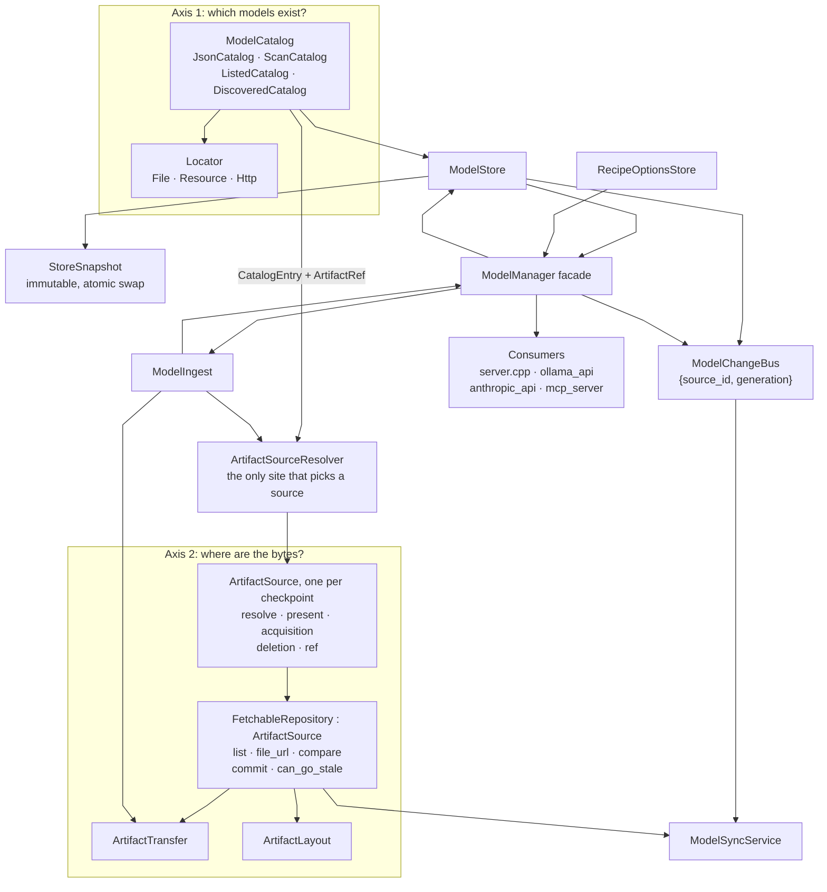

# Model Management Spec

- [Summary](#summary)
- [Scope](#scope)
- [Architecture](#architecture)
- [ModelManager Facade](#modelmanager-facade)
- [Model Catalogs](#model-catalogs)
- [Catalog Locators](#catalog-locators)
- [Model Store](#model-store)
- [Hardware Filtering](#hardware-filtering)
- [Name Resolution](#name-resolution)
- [Identity: Handles And Provenance](#identity-handles-and-provenance)
- [Two Kinds Of Staleness](#two-kinds-of-staleness)
- [Artifact Sources](#artifact-sources)
- [Fetchable Repositories](#fetchable-repositories)
- [Transfer And Layout](#transfer-and-layout)
- [Local Artifact Store](#local-artifact-store)
- [Ingest And Registration](#ingest-and-registration)
- [Sync](#sync)
- [Change Notification](#change-notification)
- [Recipe Options](#recipe-options)
- [Concurrency](#concurrency)
- [Source Layout](#source-layout)
- [Contracts](#contracts)
- [Generated Docs](#generated-docs)
- [Tests](#tests)
- [Appendix A: Implementation Sequence](#appendix-a-implementation-sequence)
- [Appendix B: Current-State Evidence](#appendix-b-current-state-evidence)

## Summary

This spec defines how lemond answers three questions: which models exist, what a model name refers to, and where a model's bytes are. It covers catalogs, the model store, name resolution, artifact sources and repositories, transfer, ingest, sync, change notification, recipe options, and the `ModelManager` that composes them and faces the HTTP layer.

The three goals that decide every design choice here:

- **Two axes.** *Which models exist* and *where the bytes come from* are separate questions with separate interfaces, joined by one value, the `ArtifactRef`. Every component sits on one axis or the other.
- **Extension is local.** A new catalog, artifact repository, or download source is one `.cpp` file, one registration line, and one descriptor. It documents itself: [Generated Docs](#generated-docs) fails CI when a registered source has no docs.
- **Clear separation of concerns.** One function resolves a name, one site binds a checkpoint to a source, one component publishes the model set, one bus announces change. A caller never re-derives an answer, and no component branches on another's identity to get one.

## Scope

This section lists what the design covers.

- **Components covered.** Catalogs and their locators, the model store and its published snapshot, name resolution and aliases, artifact sources and fetchable repositories, transfer and layout, the local artifact store, ingest, sync, change notification, recipe options persistence, and the `ModelManager` composition root and facade.
- **Documentation.** A catalog or repository documents itself through a descriptor, and CI fails when one is missing; see [Generated Docs](#generated-docs).
- **Contracts held.** The on-disk files, the API fields clients read, and the cache layout keep the meanings stated in [Contracts](#contracts). [Appendix A](#appendix-a-implementation-sequence) holds the migration steps that get there.
- **Not covered: routing.** Policy parsing, the decision engine, helper-model residency, session affinity and the `Router` rename belong to a sibling Routing spec. This spec supplies its inputs: `StoreSnapshot::helper_models` and the events in [Change Notification](#change-notification).
- **Tests.** See [Tests](#tests).

## Architecture

This section shows the two axes and the components that sit on each.



`ModelManager` is the composition root: from one `ModelManagerConfig` it builds, in this order, the change bus, the alias manager, the recipe-options store, the artifact store, the transfer mechanism, the catalog set, the store, the artifact resolver, the ingest use case and the sync service. `Server` fills in the config — cache directory, config directory, extra-models directory, the installed-backend availability probe, the cloud provider registry — constructs the facade once, and hands it to routes, gateways and routing. A test or an embedder builds the same facade over fixture paths and fixture catalogs, which is the one injection point model management offers.

Catalogs and artifact sources stay separate types because a catalog entry pointing at Qwen on Hugging Face resolves to two different objects: the document that names the model, and the repository hosting its bytes. `ArtifactRef` is the join — the value a catalog emits and a source consumes. For an imported directory one class may implement both interfaces; the types stay split because that is the exception.

## ModelManager Facade

This section defines the single model-facing interface the HTTP layer, the gateways and the router use.

`ModelManager` builds the components and owns none of their logic. It exists so orchestration has one owner instead of a route per feature: every step a route would otherwise write by hand — resolving a name, expanding alias rows for a listing, aggregating checkpoint status, sequencing a pull, projecting helper models — is one facade call.

```cpp
struct ModelManagerConfig {
    std::string cache_dir;
    std::string config_dir;
    std::string extra_models_dir;
    std::function<BackendAvailability()> availability;   // installed backends and their pools
    CloudProviderRegistry* cloud_providers = nullptr;    // listings for ListedCatalog
    std::vector<std::shared_ptr<ModelCatalog>> extra_catalogs;  // tests and embedders
};

class ModelManager {
public:
    explicit ModelManager(ModelManagerConfig);
    ~ModelManager();

    // Names
    std::optional<ResolvedModel> resolve(const std::string& requested) const;
    bool exists(const std::string& name) const;
    std::string public_name(const std::string& canonical_id) const;

    // The model set
    std::vector<ModelView> list(const ListFilter&) const;
    std::optional<ModelView> view(const std::string& name) const;
    std::vector<ModelFileInfo> files(const std::string& name) const;
    std::string filter_reason(const std::string& name) const;
    std::set<std::string> recipes_without_visible_model() const;
    std::set<std::string> helper_models() const;

    // Artifacts
    bool downloaded(const std::string& name) const;
    std::string checkpoint_path(const std::string& name, const std::string& type) const;
    DeleteResult remove(const std::string& name);
    CleanupReport cleanup_orphaned_cache();

    // Registration
    std::optional<std::string> validate(const nlohmann::json& definition) const;   // error text
    PullResult pull(const nlohmann::json& request, DownloadProgressCallback, CancelToken&);
    std::string register_model(const nlohmann::json& definition);   // canonical id
    std::string import_model(const std::string& path, const nlohmann::json& overrides);
    VariantList variants(const RepoRef&) const;
    SearchResult search(const std::string& query, const RegistryId&) const;

    // Sync
    ScanResult check_updates(const std::vector<std::string>& targets = {});
    SyncHandle sync(const std::vector<std::string>& models);
    SyncStatus sync_status() const;
    void cancel_sync();

    // Options
    json options(const std::string& name) const;
    json set_options(const std::string& name, const json& changes);

    // Aliases — delegation to the single AliasManager instance
    std::map<std::string, std::string> aliases() const;
    bool set_alias(const std::string& alias, const std::string& target, std::string& err_msg);
    bool remove_alias(const std::string& alias);

    // Change plumbing for other components
    void subscribe(std::string_view name,
                   std::function<void(const ModelChangeEvent&)>);

private:
    ModelManagerConfig cfg_;
    ModelChangeBus changes_;
    AliasManager aliases_;
    RecipeOptionsStore options_;
    ModelArtifactStore artifacts_;
    ArtifactTransfer transfer_;
    ModelStore store_;
    ArtifactSourceResolver resolver_;
    ModelIngest ingest_;
    ModelSyncService sync_;
};
```

| Rule | Consequence |
| --- | --- |
| Its only members are the components it constructs at startup, never replaced afterwards | ownership without state: no facade method mutates the facade, and nothing can drift from the store |
| Every method delegates to one component or composes at most two | a method that needs a third is a missing use case, added to the component that owns the data |
| No branch on a registry id, recipe, checkpoint type or source token | that branch is a capability method on the component instead |
| It is the only `lemon/models/` header any consumer includes | `server.cpp`, `ollama_api.cpp`, `anthropic_api.cpp`, `mcp_server.cpp` and the router include `lemon/models/model_manager.h` and nothing else from the directory |
| No component includes it | the dependency graph stays a DAG with the facade on top |

`ModelView` is the facade's projection of one model, and the contract between model management and API serialization:

| Field | Source |
| --- | --- |
| `id` | `StoreSnapshot::public_names[canonical_id]`, or the alias the caller used |
| `canonical_id` | the `StoreSnapshot` key |
| `checkpoint`, `checkpoints` | `ModelInfo::checkpoints`, each entry rendered as `repo:variant` |
| `recipe`, `labels`, `components`, `suggested` | the catalog definition that won precedence |
| `source` | `local_upload`, `local_path`, `extra_models_dir`, or a registry id |
| `registry_source` | `ArtifactRef::registry` of the `main` checkpoint, empty when the model has no registry checkpoint |
| `downloaded` | every checkpoint with `ArtifactRef::required` present, per [Artifact Sources](#artifact-sources) |
| `update_available` | any required checkpoint's repository reports newer content, per [Two Kinds Of Staleness](#two-kinds-of-staleness) |
| `checkpoint_status[]` | per checkpoint: `type`, `present`, `required`, `registry`, `path` |
| `size` | the sum over present required checkpoints, in GB |
| `cloud_provider` | set only for a model from a `ListedCatalog` |

Serialization to a response body is the HTTP layer's job. `checkpoint_status` is additive.

## Model Catalogs

This section defines the interface every source of model entries implements.

A catalog enumerates model entries and reports when its enumeration changed. The second half is what makes change notification and auto-update source-independent.

```cpp
using CatalogId = std::string;   // stable across restarts; keys ModelChangeBus

class ModelCatalog {
public:
    virtual ~ModelCatalog() = default;

    virtual CatalogId id() const = 0;
    virtual CatalogDescriptor descriptor() const = 0;

    // Middle segment minted into machine-authored IDs; empty when the catalog
    // mints none. An open set — ModelSource stays closed, see
    // [Identity](#identity-handles-and-provenance).
    virtual std::string locality() const { return {}; }

    // True: a load failure aborts startup. False: the catalog contributes none.
    virtual bool required() const { return false; }

    // Add and override entries during a store build.
    virtual void enumerate(CatalogAccumulator&) const = 0;

    // Did the ENUMERATION change? mtime, ETag, watcher event, listing digest.
    virtual bool enumeration_changed(const CatalogState&) const { return false; }
};
```

The catalogs lemond ships, with the policy each one carries:

| Catalog | Entries come from | `required()` | `locality()` | Enumeration staleness |
| --- | --- | --- | --- | --- |
| `JsonCatalog(ResourceLocator{"resources/server_models.json"}, true)` | the built-in registry shipped with lemond | true | empty | contents digest of the installed resource |
| `JsonCatalog(FileLocator{config_dir + "/user_models.json"}, false)` | `lemonade pull` and `POST /pull` | false | empty | file mtime |
| `JsonCatalog(FileLocator{<path>}, bool)` | any other JSON document of the same shape, added by code | per construction | per construction | file mtime |
| `ScanCatalog(extra_models_dir)` | an `--extra-models-dir` scan plus GGUF identification | false | empty | a `DirectoryWatcher` callback for the directory |
| `ListedCatalog(provider)` | a cloud provider's model listing | false | the provider id, e.g. `fireworks` | digest of the listing |
| `DiscoveredCatalog(recipe)` | a backend's `BackendOps::discover_models()`, used by cloud providers and `dynamic_models` descriptors | false | the recipe id | the backend reports a change, or a refresh interval elapses |

Rules:

1. A catalog is an object `Server` constructs, not a singleton. Catalog *set* policy is visible in the composition root; catalog *behavior* stays open for extension.
2. A catalog emits `CatalogEntry{canonical_id, ModelInfo definition}` through `CatalogAccumulator::add()`. The accumulator applies [precedence](#model-store), rejects reserved names, and records provenance; a catalog never writes a shared container.
3. A JSON document is a catalog only when its keys name models. `architecture_defaults.json` is keyed by architecture and `recipe_options.json` by canonical ID; both stay out of this interface, the latter under [`RecipeOptionsStore`](#recipe-options).
4. `ListedCatalog` and `DiscoveredCatalog` reach their provider or backend through an injected `std::function`, so the store holds no concrete include of the provider or backend layer.
5. Every catalog declares a [`CatalogDescriptor`](#descriptors) at construction, which is what puts it in the docs.
6. A `Locator` describes how a *document body* is fetched, so it belongs only to `JsonCatalog`. A catalog with no body takes its input directly: `ScanCatalog(path)`, `ListedCatalog(provider)`, `DiscoveredCatalog(recipe)`.

## Catalog Locators

This section defines how a catalog is read, which is orthogonal to what it contains.

```cpp
struct FileLocator     { std::string path; };              // a config-dir file
struct ResourceLocator { std::string resource_path; };     // an embedded resource
struct HttpLocator {
    std::string url;
    std::string cache_path;    // last good body, used when the fetch fails
};

using Locator = std::variant<FileLocator, ResourceLocator, HttpLocator>;

class JsonCatalog : public ModelCatalog {
public:
    JsonCatalog(Locator locator, bool required);
    ...
};
```

The locator decides how a body is fetched and how a change is detected:

| Locator | Read policy | `enumeration_changed()` | Failure policy |
| --- | --- | --- | --- |
| `FileLocator` | read the file | mtime or size differs | missing or unparseable contributes no entries when `required()` is false; throws when it is true |
| `ResourceLocator` | `utils::get_resource_path()`, then read | contents digest differs | throws when `required()` |
| `HttpLocator` | `GET url` with `If-None-Match` / `If-Modified-Since` from `cache_path`; a 304 keeps the cached body | ETag or Last-Modified differs from the cached pair | falls back to the cached body, then to no entries, when `required()` is false; with `required()` true and no cache, throws |

Rules:

1. One parse primitive turns a fetched body into `CatalogEntry` values, so an error message reads the same whichever locator supplied the document.
2. `HttpLocator` fetches during its own catalog's refresh, never on another catalog's startup path.
3. `HttpLocator` stores only the response body and its validators in `cache_path`. It touches no model bytes and no sync queue.

## Model Store

This section defines the aggregate view over all catalogs and the snapshot it publishes.

The merged result of N catalogs is a store, not a catalog. `ModelStore` owns merge, precedence, public aliasing, hardware filtering and download status, and publishes a `StoreSnapshot`.

```cpp
struct RejectedModel {
    std::string canonical_id;
    std::string reason;      // the text a caller returns for an unavailable model
    RejectCause cause;       // BackendMissing | MemoryFit | RecipeEmpty | RegistryUnknown
};

struct StoreSnapshot {
    std::map<std::string, ModelInfo> models;              // canonical id -> info
    std::map<std::string, std::string> public_aliases;    // any accepted name -> canonical id
    std::map<std::string, std::string> public_names;      // canonical id -> listed name
    std::vector<RejectedModel> rejected;                  // filter rejections
    std::vector<std::string> empty_recipes;               // recipes with no visible model
    std::set<std::string> helper_models;                  // projection of route_policy->helper_models
    std::uint64_t generation;                             // ModelChangeBus generation
};

class ModelStore {
public:
    std::shared_ptr<const StoreSnapshot> snapshot() const;   // atomic load, no lock
    void rebuild(RebuildReason, const BackendAvailability&);      // off-thread, then swap
    std::optional<ResolvedModel> resolve(const std::string& requested) const;
    std::map<std::string, ModelInfo> supported_models() const;   // what /v1/models lists
    std::map<std::string, ModelInfo> downloaded_models() const;
    std::optional<std::shared_ptr<const ModelInfo>> info(const std::string& canonical_id) const;
    bool exists(const std::string& requested) const;
};
```

`info()` returns an aliasing `shared_ptr` into the published snapshot, so a caller holding a `ModelInfo` across a request keeps a valid object after the next swap.

`StoreBuilder` runs the pipeline as ordered steps over a mutable `StoreDraft`:

1. **Catalog ingest.** Every catalog contributes its entries, and the accumulator resolves `user.` over `extra.` over `builtin.` by `precedence_rank()` (`canonical_id.h`).
2. **Hardware filter.** `filter_hardware(models, availability)`, described in [Hardware Filtering](#hardware-filtering).
3. **Artifact status.** `ArtifactSource::present()` sets `downloaded`, and `ArtifactSource::resolve()` fills `ModelInfo::resolved_paths` per checkpoint.
4. **Metadata population.** `BackendOps::populate_metadata()` fills context window and capability labels for present models.
5. **Alias and projection rebuild.** `public_aliases`, `public_names` and `helper_models` are computed.

Rules:

1. The snapshot is write-once: no mutators, built off-thread, published with `std::atomic_store`. A reader sees the old valid set or the new valid set, never a partial one.
2. `public_aliases` and `public_names` are computed from the **pre-filter** model set, so a component's alias resolves the same way whether or not its model currently survives the filter. `helper_models` is projected from the policies of visible models.
3. Download status comes from artifact sources, never from a comparison on `ModelInfo::source`.
4. The store runs no thread. A rebuild is requested through `ModelChangeBus` and runs on the executor the change bus designates.
5. The five steps are private methods of `StoreBuilder`. The pipeline is fixed, not a pluggable stage list: a new stage is an edit to `StoreBuilder`, which is exactly the friction wanted here.

## Hardware Filtering

This section defines how backend availability and memory fit narrow the visible model set.

`filter_hardware()` answers which of these models this machine can run now, and returns the visible set and the reasons for the rest together. It is a function, not a class: it holds no state, and the store and the ingest path are its only two callers — the whole set during a rebuild, and one entry when a definition is added to the set.

```cpp
struct FilterResult {
    std::map<std::string, ModelInfo> visible;
    std::vector<RejectedModel> rejected;
    std::vector<std::string> empty_recipes;
};

// store_builder.h, beside StoreBuilder
FilterResult filter_hardware(const std::map<std::string, ModelInfo>&,
                             const BackendAvailability&);
```

`BackendAvailability` says which recipes can run now and how large their memory pools are. The `ModelManagerConfig.availability` probe produces it at the start of every rebuild, so the models layer never includes a backend header.

Rules:

1. Every build produces `StoreSnapshot::rejected` and `StoreSnapshot::empty_recipes` for the whole set. There is no build mode that skips them, and no side table for a caller to remember to consult.
2. Memory-fit inputs are `ModelInfo::size` and `ModelInfo::min_resident_gb`, against the streaming pools in `BackendAvailability`. The working-set comparison — `streaming_working_set_gb()` and `streaming_model_exceeds_pool()` — are file-local helpers beside `filter_hardware()`.
3. A rejection reason is retrieved from the snapshot by canonical id, so an error message and the set it describes are always the same generation.

## Name Resolution

This section defines the one function every surface calls to turn a requested name into a model.

```cpp
// lemon/models/alias_manager.h — the alias map, with no interface above it.
class AliasManager {
public:
    static constexpr size_t MAX_ALIAS_CHAIN_DEPTH = 10;

    explicit AliasManager(std::string cache_dir = "");  // "": in-memory, no file I/O

    bool set_alias(const std::string& alias, const std::string& target, std::string& err_msg);
    bool remove_alias(const std::string& alias);
    std::optional<std::string> resolve_alias(const std::string& alias_or_name) const;
    bool has_alias(const std::string& alias) const;
    std::map<std::string, std::string> get_all_aliases() const;   // sorted
    void load();
    void save();
private:
    std::string cache_dir_;
    mutable std::shared_mutex mutex_;
    std::map<std::string, std::string> aliases_;
};

struct ResolvedModel {
    std::string canonical_id;                 // StoreSnapshot key
    std::string wire_id;                      // id echoed back to the client
    std::shared_ptr<const ModelInfo> info;
    bool via_alias = false;
};
```

`ModelStore::resolve(requested)` runs these steps:

1. Normalize with `utils::normalize_model_name()` and strip a trailing `:latest`.
2. Look the name up in `StoreSnapshot::public_aliases`. A hit wins: exact canonical ID, then the bare-name precedence winner, then a model's `input_aliases`.
3. With no snapshot hit, call `AliasManager::resolve_alias()` — up to `AliasManager::MAX_ALIAS_CHAIN_DEPTH` hops, and a cycle yields no target.
4. Resolve the alias target against the snapshot, falling back to the one-hop target when the chained target is absent.
5. On a hit set `canonical_id` to the snapshot key, `via_alias` to whether step 3 was used, and `wire_id` to `StoreSnapshot::public_names[canonical_id]`, or to the requested name when `via_alias` is true so a client that asked by alias is answered under that alias.
6. On a miss return `std::nullopt`, and let the caller produce its own 404 shape.

Rules:

1. The snapshot wins over an alias, and `POST /internal/aliases` rejects an alias that collides with a canonical model name with 409, so a colliding pair cannot be created.
2. `AliasManager` lives at `src/cpp/include/lemon/models/alias_manager.h` with its implementation in `src/cpp/server/models/alias_manager.cpp`. It owns `<cache_dir>/aliases.json` in mode `0600`, writes it on every mutation, prunes cyclic chains at load, and guards its map with one `std::shared_mutex`. `ModelManager` constructs the one instance from `ModelManagerConfig.cache_dir`; the alias routes and `lemonade alias` reach it through `ModelManager::set_alias()` and `ModelManager::remove_alias()`, which delegate to that instance.
3. Aliases are consulted at resolution time, never folded into the snapshot. An alias mutation takes effect on the next request with no store rebuild and no change event.
4. `ModelStore` holds a `const AliasManager&`, with no interface between them: `AliasManager("")` has no cache directory, so `load()` and `save()` do nothing and the object is an in-memory map a store test populates with `set_alias()`. The reference is never null, so alias lookup needs no guard and `POST /internal/aliases` has no "manager uninitialized" path.
5. `get_all_aliases()` returns a `std::map`, so `/internal/aliases` and the alias rows of `/v1/models` come out in a stable order and a golden test is reproducible.
6. `ModelManager::list()` appends one row per alias that resolves to a listed model, with `id` set to the alias. The route serializes and does nothing else.
7. Every gateway resolves through this function, so aliases mean the same thing on the OpenAI, Ollama, Anthropic and MCP surfaces.

## Identity: Handles And Provenance

This section defines the two identity axes and which one is extensible.

| Axis | Content | Extensible | Used by |
| --- | --- | --- | --- |
| **Handle** | `<source-token>.<bare>` | No, deliberately closed | user input, `user_models.json` keys, `recipe_options.json` keys, the API `model` field, `Decision::route_to` |
| **Provenance** (`ArtifactRef`) | `{registry, repo_id, variant, revision, required}` | Yes, this is the join | cache directory naming, blob dedup, update check, `.lemonade_registry.json` |

```cpp
struct ArtifactRef {
    RegistryId registry;        // "huggingface", "modelscope", ...
    std::string repo_id;        // "Qwen/Qwen3-0.6B-GGUF"
    std::string variant;        // "Q4_K_M", a file name, or empty
    std::string revision;       // "main", "master", or an explicit sha
    bool required = true;       // false: absent bytes do not clear `downloaded`
};
```

The artifact key is `f(registry, repo, snapshot)`, computed without touching the handle grammar, which is how blob-level sharing across models works.

### Handle Grammar

`ModelSource` and the prefixes `user.`, `extra.` and `builtin.` stay closed. The guard is a security boundary: `is_reserved_registration_name()` (`canonical_id.h`) prevents `user.builtin.Foo` from taking a built-in alias slot, and `precedence_rank()` defines shadowing. New catalogs register into the store; they mint no new source token.

```text
handle ::= <source-token> '.' <bare>     // closed set: user | extra | builtin
bare   ::= [ <locality> '.' ] <name>     // locality only when the ID is machine-minted
```

Each source mints handles under these rules:

| Source | Authored by | Locality | Notes |
| --- | --- | --- | --- |
| `builtin.` | `server_models.json` | none | the registry is an attribute of the entry |
| `user.` | a human | never | the registry stays in `registry_source` |
| `extra.` | `ScanCatalog` | registry of origin when inferable | none |
| `ListedCatalog` | the provider listing | the provider id | `fireworks.deepseek-ai/deepseek-v3` |
| `DiscoveredCatalog` | the backend | the recipe id | scoped to what the backend owns |

A locality token set is open, `ModelSource` stays closed, and both are known at compile time. `is_reserved_registration_name()` rejects `user.<known-locality>.…`, which closes the case where a user registers `user.fireworks.foo` and shadows a cloud entry's public name through precedence.

Rules:

1. The rejection applies at registration: `ModelManager::validate()`, `ModelIngest`, and `lemonade recipe-import`. An entry already on disk under a name the rule would reject keeps loading and resolving, so an upgrade never hides a user's model.
2. `user.` holds one repository per bare name. Repointing a `user.` model at a different registry is a provenance change: an explicit replace that errors on conflict, never two coexisting IDs a user disambiguates.
3. Every registered catalog's minted IDs round-trip through `parse_canonical_id()` and pass `is_reserved_registration_name()`, asserted in a unit test that enumerates the catalogs. The grammar is a checked contract, and its [generated table](#descriptors) is the same list.

### Registry Identity

A registry is identified by an interned string, `RegistryId`, resolved through [Fetchable Repositories](#fetchable-repositories). There is no registry enum.

The string form is the public interface, because it appears in four places the design does not control: `user_models.json` `registry_source`, `.lemonade_registry.json` `source`, the `source` field accepted by `POST /pull` and `--source`, and the literals the desktop app compares against in `utils/modelData.ts`, `AddModelPanel.tsx` and `ModelOptionsModal.tsx`. A new registry is simply another accepted value in all four.

An unknown `RegistryId` in a persisted entry logs one warning naming the model and the id, contributes no entry for that model, and leaves the rest of the catalog loaded. Startup does not abort.

## Two Kinds Of Staleness

This section separates the two change questions a client can ask.

| | Catalog staleness | Artifact staleness |
| --- | --- | --- |
| Question | did the list of models change? | did a model's bytes change? |
| Signals | file mtime, contents digest, HTTP ETag / Last-Modified, listing digest | commit SHA, LFS content id, tree fingerprint |
| Cost | one stat call or one metadata request | one or more network round trips per repository |
| Detector | `ModelCatalog::enumeration_changed()` | `FetchableRepository::compare()` |
| Result | `{source_id, generation}` on `ModelChangeBus`, then a rebuild | `update_available` in the snapshot |
| Client surface | none; an event inside lemond | `/v1/models`, `POST /models/check-updates`, `POST /internal/models/sync` |

`update_available` means a repository's commit advanced. A catalog gaining an entry sets no `update_available` and adds no field to a response; it raises a change event that rebuilds the store. A "new models available" surface is a later RFC.

## Artifact Sources

This section defines the per-checkpoint role every model with bytes answers through. There is one source object per checkpoint, and it is built by the resolver.

```cpp
enum class ArtifactKind { Registry, Filesystem, Local, SelfManaged, None };

struct Presence {
    bool complete = false;
    std::string path;        // resolved location, empty when absent
    std::string reason;      // why incomplete
};

struct Acquisition {
    enum class Kind { Nothing, Plan, Delegated, NotApplicable } kind;
    DownloadPlan plan;       // Kind::Plan
    std::string delegate;    // Kind::Delegated: who fetches it, for the error text
};

struct Deletion {
    enum class Kind { Nothing, CacheDir, Delegate } kind;
    std::string reason;      // Delegate: the command the backend owns, e.g. "flm remove"
};

// A source is constructed for one checkpoint and carries its ArtifactRef, so
// the role methods below take no arguments.
class ArtifactSource {
public:
    virtual ~ArtifactSource() = default;

    virtual ArtifactKind kind() const = 0;
    const ArtifactRef& ref() const { return ref_; }   // registry, repo, variant, required

    virtual std::string resolve() const = 0;          // where the bytes are now
    virtual Presence present() const = 0;
    virtual Acquisition acquisition() const = 0;
    virtual Deletion deletion() const = 0;

protected:
    explicit ArtifactSource(ArtifactRef ref) : ref_(std::move(ref)) {}

    ArtifactRef ref_;
};
```

The sources lemond ships, with the behavior each declares:

| Implementation | Roles | `list()` / `file_url()` | Staleness | Layout | Transfer | Deletion |
| --- | --- | --- | --- | --- | --- | --- |
| `HuggingFaceRepository` | both | tree API | commit SHA plus LFS content id | HF snapshots and blobs with `refs/main` | HTTP | `CacheDir`; blob GC is decided by [Local Artifact Store](#local-artifact-store) |
| `ModelScopeRepository` | both | files API | tree fingerprint | snapshot per tree, own namespace | HTTP | `CacheDir` in its namespace |
| `LocalPathArtifactSource` | core | none | never stale | n/a | n/a | `Nothing` or `CacheDir` by origin, see [Deletion](#deletion) |
| `SelfManagedArtifactSource` | core | none | the backend's concern | the backend's | `Delegated` | `Delegate` |
| `NoArtifactsSource` | core | none | never | n/a | `NotApplicable` | `Nothing` |

Presence is existence plus the backend's own validation of the resolved file — `BackendOps::validate_checkpoint_file()` runs on it, so a GGUF file without magic bytes is not present. A cloud model is `NoArtifactsSource`: `downloaded` is true, `size` is 0, and nothing is fetched or deleted.

### Selection

This section defines the one place a checkpoint is bound to a source.

```cpp
class ArtifactSourceResolver {
public:
    // Sources are built during a store build and live with the generation that
    // published them, so a reader holding a source and a reader holding the
    // snapshot always agree.
    const ArtifactSource& source_for(const ModelInfo&,
                                     const std::string& checkpoint_type) const;
    const ArtifactLayout& layout_for(const ModelInfo&,
                                     const std::string& checkpoint_type) const;
};
```

For each entry of `ModelInfo::checkpoints`, the resolver picks the first matching rule:

1. Recipe `cloud`: `NoArtifactsSource`.
2. `BackendOps::plan_download()` returns `SelfManaged`: `SelfManagedArtifactSource`.
3. The catalog entry's origin is `local_path`, `local_upload` or `extra_models_dir`: `LocalPathArtifactSource`.
4. The entry names an explicit scheme (`hf://`, `ms://`, `file://`): the repository registered for that scheme.
5. `checkpoint_looks_like_repo_id()` matches: the registry in `ArtifactRef::registry`, defaulting to the `default_model_source` config key.
6. The checkpoint path exists on disk: `LocalPathArtifactSource`.
7. Otherwise: a registration error.

Rules:

1. Selection is per checkpoint. A checkpoint whose bytes live somewhere else — an imported directory, a lazily fetched compiled cache, a cloud entry with no bytes — is an ordinary checkpoint with an ordinary source, and no function needs a clause to skip it.
2. Step 2 dispatches through `BackendOps` and step 4 through the repository registry, so a new registry adds a repository, a new self-managed backend overrides `plan_download()`, and this list grows only for a new local scheme. It is the one list allowed to grow, because it *is* the product's source model.
3. `ModelInfo::source` carries a registry id or one of the three local origin tokens, which is what `/v1/models` reports. It selects no behavior: registration validation accepts a registry id or one of those tokens, and every other decision asks the resolver.
4. Model-level status aggregates checkpoint-level answers. `downloaded` is true when every checkpoint whose `ArtifactRef::required` is true reports `Presence::complete`. `update_available` is true when any required checkpoint's repository reports newer content.
5. `required` defaults to true. A lazily acquired checkpoint sets it false; `npu_cache`, the `.rai` file a whisper backend pulls beside its `.bin` on first NPU use, is the shipped case. Absent bytes there leave the model downloaded.
6. Checkpoints of one model share one registry. `apply_default_pull_source()` (`model_registry.cpp`) rejects a body whose checkpoints name different registries, and `docs/dev/model-registries.md` states that rule. Source *kind* varies per checkpoint; *registry* does not. The shipped Whisper models satisfy it: `main` and `npu_cache` name different repositories, both on Hugging Face.

## Fetchable Repositories

This section defines the pullable role layered on an artifact source, and what a repository may own.

```cpp
class FetchableRepository : public ArtifactSource {
public:
    virtual RegistryId id() const = 0;
    virtual RepositoryDescriptor descriptor() const = 0;
    virtual Revision default_revision() const = 0;       // "main" vs "master"

    virtual RepoListing list(const std::string& repo_id,
                             const std::string& revision = "") const = 0;
    virtual std::string file_url(const RepoRef&) const = 0;
    virtual std::map<std::string, std::string> auth_headers() const { return {}; }

    virtual bool can_go_stale() const = 0;
    virtual Revision active_revision(const LocalRef&) const = 0;
    virtual void set_active_revision(const LocalRef&, const Revision&) = 0;
    virtual Staleness compare(const LocalRef&, const RepoListing&) const = 0;
    virtual void commit(const LocalRef&, const Revision&) = 0;

    virtual std::string cache_dir_name(const std::string& repo_id) const = 0;

    virtual bool supports_search() const { return false; }   // backs /registry/search
};

LEMONADE_REGISTER_ARTIFACT_REPOSITORY(HuggingFaceRepository, huggingface_descriptor());
LEMONADE_REGISTER_ARTIFACT_REPOSITORY(ModelScopeRepository, modelscope_descriptor());
```

`display_name`, endpoint, environment variables, URL shape, cache-directory prefix, revision semantics and staleness basis all live in the [`RepositoryDescriptor`](#descriptors), which is also what the docs generator reads. Registration is a static initializer keyed by `RegistryId`: no `dlopen`, no C ABI, no plugin boundary. Every method but the pure virtuals has a default, so adding a capability later edits no existing repository.

These value types carry data across the ports:

| Type | Contents |
| --- | --- |
| `RepoListing` | `{repo_id, revision, files}` where `files` are `RegistryFile{path, size, hash_algorithm, hash, directory}` |
| `RepoRef` | `{repo_id, revision, path}` — the argument to `file_url()` |
| `LocalRef` | `{repo_id}` resolved against the models directory — a repository's local namespace for one repository |
| `Revision` | `{id, pinned}` — `pinned` true for an immutable commit SHA, false for a mutable branch such as ModelScope's `master` |
| `Staleness` | `{update_available, local_snapshot_id, remote_snapshot_id, changed_files}` |
| `CheckpointRef` | `{canonical_id, checkpoint_type}` — the key [Selection](#selection) builds a source from |
| `ProvenanceRecord` | `{ArtifactRef, snapshot_id}` — one entry written to `.lemonade_registry.json` |
| `CatalogState` | one catalog's validators from its last build: mtime, contents digest, ETag, Last-Modified, listing digest, watcher flag |
| `CatalogAccumulator` | the sink a catalog writes to: `add(CatalogEntry)`, plus the precedence and reservation checks in [Model Store](#model-store) |
| `BackendAvailability` | which recipes can run now and their memory pools — the input to [`filter_hardware()`](#hardware-filtering) |

**Policy versus mechanism is the line that must hold.** The left column is per-source; the right column is shared, because duplicating it per source re-creates a god object.

| The repository owns | Shared mechanism |
| --- | --- |
| `auth_headers()`, endpoint and env resolution: `HF_ENDPOINT`, `HF_TOKEN`, `MODELSCOPE_ENDPOINT`, `MODELSCOPE_API_TOKEN` | transfer: retries, resume, hash verify, progress, cancel — [`ArtifactTransfer`](#transfer-and-layout) |
| `list()`, `file_url()` | snapshot and blob layout with journaling — [`ArtifactLayout`](#transfer-and-layout) |
| Revision semantics: `refs/main` read, write and resolution, which Hugging Face needs and ModelScope's branch API does not | the sync queue, cancellation, progress reporting |
| Staleness basis: Hugging Face compares LFS content ids across commits, ModelScope compares tree fingerprints | catalog merge, precedence, public aliasing |
| `cache_dir_name()`, including the `models--` and `modelscope--` prefixes | `ModelChangeBus` |
| Artifact selection: `select_main_repo_files()`, `group_aux_checkpoint_variants()` | `ModelView` assembly |
| `search()` behind `supports_search()`, backing `/registry/search` | |

Rules:

1. There is no `Repo::download()`. The orchestrator is `list` → select files → build `DownloadPlan` → `ArtifactTransfer::execute(plan)` → `repo.commit()`. Transfer is mechanism; a repository that owns a copy of it has duplicated a protocol-independent loop.
2. A transfer protocol that HTTP cannot serve — git-LFS batch, S3 signed multipart — is a second `ArtifactTransfer` implementation chosen at the one place plans are executed. Until one exists, `ArtifactTransfer` is a concrete class with no virtual: a seam nobody uses is not a seam.
3. `compare()` is the only place file metadata is read from a provider, through `list()`. No caller assembles a provider URL or parses a provider's tree response.
4. Cache layout per registry follows `docs/dev/model-registries.md`: `refs/main`, `snapshots/<snapshot-id>/` and `.lemonade_registry.json` under a provider-qualified repository directory.

## Transfer And Layout

This section defines the shared mechanism that turns a plan into bytes on disk, and where those bytes land.

```cpp
struct DownloadFile {
    std::string name;
    std::string url;
    std::uint64_t size = 0;
    std::string expected_hash_algorithm;   // "sha256"
    std::string expected_hash;             // LFS object id or git blob oid
    std::string download_path;             // per-file override for multi-repository plans
};

struct DownloadPlan {
    std::string download_path;             // default target directory
    std::vector<DownloadFile> files;       // files_count is files.size()
};

class ArtifactTransfer {
public:
    void execute(const DownloadPlan&,
                 DownloadProgressCallback progress,
                 CancelToken& cancel) const;
};
```

`ArtifactTransfer::execute()` performs these steps, and they are the contract:

1. Check free disk space across the whole plan before transferring anything, crediting bytes already on disk including `.partial` files, and folding target directories that share a filesystem into one check.
2. Report progress in bytes with the total across all files, and check the cancel token before each file. A cancellation throws.
3. Reject a cached `.gguf` file that lacks the GGUF magic bytes before treating it as complete, so a saved HTML error page never reaches a backend that would fail on it later.
4. Transfer each file with `max_retries = 10`, `initial_retry_delay_ms = 2000`, `max_retry_delay_ms = 120000`, `resume_partial = true`, `low_speed_limit = 1000` bytes per second, `low_speed_time` from `utils::HttpClient::get_default_timeout()`, and `connect_timeout = 60`.
5. Verify `expected_hash` per file. A mismatch is a failure, not a retry.

`ArtifactLayout` names the on-disk shape of a repository's cache: snapshot directory, `refs/main`, blob directory, `.partial` and `.download_manifest.json` locations, and the call that makes a staged snapshot current. Two layouts ship:

| Layout | Placement | Used by |
| --- | --- | --- |
| `HfHubLayout` | `refs/main`, `snapshots/<snapshot-id>/`, `blobs/`, staged through `.partial` | every registry checkpoint, per `docs/dev/model-registries.md` |
| `SiblingLayout` | the file lands next to the model's `main` checkpoint file, after a containment check on the resolved name | the `npu_cache` checkpoint, which `whispercpp` requires beside its `.bin` |

Layout selection rules:

1. `ArtifactSourceResolver::layout_for()` is the only place a layout is chosen. It returns `HfHubLayout` unless `BackendOps::checkpoint_layout()` returns a layout for that checkpoint type; that hook returns `nullptr` by default, and `whispercpp` returns `SiblingLayout` for `npu_cache`.
2. `ModelArtifactStore` and `ArtifactTransfer` consume the resolved `ArtifactLayout` and nothing else, so no component branches on a checkpoint type string.

## Local Artifact Store

This section defines the component that performs local disk mechanics.

`ModelArtifactStore` owns path resolution, completeness checks, deletion, provenance files and cache cleanup. It holds no catalog knowledge, and it asks an `ArtifactSource` what a checkpoint is before touching it.

```cpp
class ModelArtifactStore {
public:
    std::string resolve_path(const ModelInfo&, const std::string& checkpoint_type) const;
    bool complete(const ModelInfo&) const;
    std::vector<ModelFileInfo> list_files(const ModelInfo&) const;
    DeleteResult delete_artifacts(const ModelInfo&, const StoreSnapshot&);
    CleanupReport cleanup_orphaned_cache(const StoreSnapshot&);
    void write_provenance(const std::string& cache_dir,
                          const std::vector<ProvenanceRecord>&);
    std::vector<ProvenanceRecord> read_provenance(const std::string& cache_dir) const;
};
```

A `ProvenanceRecord` is `{ArtifactRef, snapshot_id}`. `ArtifactRef` already holds the registry, repository, variant and revision, so provenance needs no type of its own beyond the snapshot that was materialized.

### Deletion

Deleting a checkpoint is polymorphic, because a forgotten branch deletes a user's model directory.

| Source | `Deletion` | Effect |
| --- | --- | --- |
| `HuggingFaceRepository`, `ModelScopeRepository` | `CacheDir` | remove the repository directory; blob GC only for blobs no other model references |
| `LocalPathArtifactSource`, `local_path` or `extra_models_dir` origin | `Nothing` | unregister the model; the bytes the user placed stay |
| `LocalPathArtifactSource`, `local_upload` origin | `CacheDir` | remove the copy lemond wrote inside its own cache directory |
| `SelfManagedArtifactSource` | `Delegate("flm remove")` | the backend removes its own weights |
| `NoArtifactsSource` | `Nothing` | unregister only |

Rules:

1. `CacheDir` requires a containment proof: the resolved path is inside the configured models directory after resolving symlinks. A checkpoint that cannot prove containment is unregistered and logged, never deleted.
2. Blob reachability and shared-repository scope are computed here, not by the source: both need the whole model map, which a per-checkpoint source never sees. A source answers only `CacheDir` or `Nothing`. A shared repository referenced by several models loses only the variant being removed.
3. `delete_artifacts()` completes for every source, including bytes that sit outside any cache directory: the answer there is `Nothing`, not a failure.
4. A collection removes components by the same per-checkpoint rules, and a model still referenced by a loaded collection is refused.

### Provenance File

Each repository cache directory holds one `.lemonade_registry.json`, version 2:

```json
{
  "version": 2,
  "source": "huggingface",
  "repo_id": "unsloth/Muse-Glimmer-30B-GGUF",
  "revision": "main",
  "snapshot_id": "…",
  "processed_models": {
    "Muse-Glimmer-30B-GGUF": {
      "checkpoints": {
        "main":   {"selection": "…", "snapshot_id": "…"},
        "mmproj": {"selection": "…", "snapshot_id": "…"}
      }
    }
  }
}
```

Rules:

1. `processed_models[<canonical_id>].checkpoints` is keyed by checkpoint type, so two checkpoints of the same model can carry different snapshots.
2. `selection` is the artifact selection the snapshot was materialized for; an entry matches only when both fields agree, which is what makes a re-pull of a changed selection fetch again.
3. A file with no `version`, or `version: 1`, is read with its `{selection, snapshot_id}` entry standing for the `main` checkpoint. Writes are always v2. Files on existing user disks stay readable forever.
4. Top-level `source`, `repo_id`, `revision` and `snapshot_id` describe the repository and are independent of the per-checkpoint map.

## Ingest And Registration

This section defines the use cases that create, validate and remove model definitions.

```cpp
class ModelIngest {
public:
    std::optional<std::string> validate(const nlohmann::json& definition) const;  // error text
    PullResult pull(const nlohmann::json& request, PullMode,
                    DownloadProgressCallback, CancelToken&);
    std::string register_model(const nlohmann::json& definition);   // canonical id
    std::string import_model(const std::string& path, const nlohmann::json& overrides);
    void unregister_model(const std::string& canonical_id);

private:
    // A collection manifest is a nested catalog: its entries go through the
    // same CatalogAccumulator precedence rules as any other source.
    std::vector<CatalogEntry> resolve_collection(const std::string& collection_id) const;
    void register_components(const std::vector<CatalogEntry>&, const std::string& owner);
};
```

`ModelIngest::pull()` performs no HTTP. It resolves the definition, validates it, selects artifacts, and asks each selected source for `acquisition()`: a `DownloadPlan` goes to `ArtifactTransfer`, `Delegated` returns a message naming the backend that owns the fetch, `NotApplicable` returns success with no bytes. These invariants hold in every path:

1. A collection registers before its components resolve, and rolls that registration back when component resolution fails.
2. The cycle guard is scoped to the current recursion stack, so a legitimate DAG such as `A -> {B, C} -> D` is not read as a cycle.
3. Registration and recipe options persist **before** a cache shortcut returns, which is what makes a re-pull and an import idempotent.
4. Progress callbacks are wrapped so a recursive per-component download emits exactly one terminal `complete` event to the SSE stream.
5. `do_not_upgrade` skips a fetch, never a registration.

### Backend Directives

This section keeps backend policy from depending on the model layer.

`BackendOps` has the right shape — every method has a default, so adding a method never edits backends that do not override it — and its context carries what it needs by const reference:

```cpp
// Declared beside BackendOps; the registry and variant a download needs already
// live in the checkpoint's ArtifactRef, so the directive states only who fetches.
enum class DownloadPolicy { Repository, SelfManaged, None };

// backend_ops.h forward-declares ModelArtifactStore.
struct BackendOpsContext {
    const ModelArtifactStore& artifacts;         // disk state, const calls only
    CloudProviderRegistry* cloud_registry;       // dynamic discovery
};

class BackendOps {
public:
    virtual DownloadPolicy plan_download(const ModelInfo&,
                                         const BackendOpsContext&) const {
        return DownloadPolicy::Repository;
    }
    virtual bool is_downloaded(const ModelInfo& info,
                               const BackendOpsContext& ctx) const {
        return ctx.artifacts.complete(info);
    }
    virtual const ArtifactLayout* checkpoint_layout(const CheckpointRef&) const { return nullptr; }
};
```

1. `plan_download()` states *what* a backend needs fetched; `ModelIngest` performs it. This is where a backend that pulls its own weights declares that fact, and the ingest path has no per-backend branch.
2. A lazily fetched side cache — the whisper `npu_cache` `.rai` file — is a checkpoint with `required = false`, a repository, an explicit filename, `SiblingLayout`, and the shared engine's traversal guards, retries, resume, hash verification and cancellation. The backend keeps no download code and no path-resolution branch.
3. `BackendOpsContext` holds `ModelArtifactStore` by const reference. Backend policy reads disk state through `complete()` and holds no reference to the model layer.

## Sync

This section defines update scanning and the queue that applies updates.

```cpp
class ModelSyncService {
public:
    ScanResult scan_for_updates(const std::vector<std::string>& targets = {});
    SyncHandle sync(const std::vector<std::string>& models, SyncMode);
    std::string enqueue_sync(const std::vector<std::string>& models);
    SyncStatus status() const;
    void cancel();
    bool should_auto_update(const ModelInfo&) const;
};
```

`scan_for_updates()` runs these steps:

1. Select targets: the named models, or every downloaded model with a required checkpoint whose source is a `FetchableRepository`.
2. Drop every checkpoint whose source answers `can_go_stale()` with false. Cloud, local and imported models drop out on their own capability, not on a caller's list.
3. Group the survivors by `(registry, repo_id, revision)`, so one round trip answers for every model sharing a repository.
4. Call `list()` once per group, then `compare()` per checkpoint, reusing the previous snapshot where a repository's `compare()` says the selected artifacts are unchanged.
5. Publish one rebuilt snapshot carrying the new `update_available` flags, and one change event.

Rules:

1. This service owns the only threads in model management: a serial queue, cancellation, `ModelSyncState`, and the SSE-visible phase machine.
2. Auto-update after startup runs as a queued sync. `should_auto_update()` and `ModelInfo::auto_update` are the per-model override.
3. Its mutex and condition variable are disjoint from store state, and it publishes only by requesting a rebuild.
4. `POST /models/check-updates` rejects with 409 when `offline=true`, and neither scanning nor syncing touches the network when offline.

## Change Notification

This section defines how a catalog or repository change reaches interested components.

```cpp
struct ModelChangeEvent {
    std::string source_id;   // CatalogId or RegistryId
    ChangeSubject subject;   // Catalog | Repository
    std::uint64_t generation;
};

class ModelChangeBus {
public:
    void subscribe(std::string_view name,
                   std::function<void(const ModelChangeEvent&)>);
    void publish(ModelChangeEvent event);   // returns after queueing
};
```

1. An event names the subject that changed, so a subscriber recomputes only for a source it cares about. The helper-model projection and any routing rebuild subscribe by `CatalogId` and ignore the rest.
2. Subscribers register while `ModelManager` is being constructed and live as long as lemond, so `subscribe()` returns nothing and there is no unsubscribe handle.
3. Callbacks run outside every lock. A callback that needs model data requests a rebuild rather than reading a partially built draft.
4. `StoreSnapshot::generation` is the one generation counter: a subscriber coalesces on it, and a reader can tell which snapshot a change produced.
5. Producers are: a catalog whose `enumeration_changed()` returned true, a completed ingest or deletion, a completed `ModelSyncService` scan, and a config change that alters the catalog set. An alias mutation produces none.

## Recipe Options

This section defines persistence for per-model load options.

`RecipeOptionsStore` owns the file, the CRUD and the migration. The `RecipeOptions` value type (`src/cpp/include/lemon/recipe_options.h`) and its `merge_precedence_layers()` hold no persistence; the store calls them.

```cpp
class RecipeOptionsStore {
public:
    json entry(const std::string& canonical_id) const;      // the user's own entry
    json resolved(const std::string& canonical_id,
                  const ModelInfo&) const;                  // three-layer merge
    json registry_defaults(const std::string& canonical_id) const;
    json replace(const std::string& canonical_id, const json& entry);
    json merge(const std::string& canonical_id, const json& changes);
    void migrate();
};
```

1. Keys are canonical IDs, so re-registering a model under a different source is an explicit key move.
2. The component owns one mutex, which orders rewrites and is never held while calling into another component.
3. It reads no catalog and no artifact state; the architecture-defaults overlay it merges arrives as a `const json&` from the caller.
4. `migrate()` normalizes entries to the current canonical form once at startup and logs the count it changed.

## Concurrency

This section assigns each piece of state to one owner and one synchronization strategy.

| State | Owner | Synchronization |
| --- | --- | --- |
| `StoreSnapshot` | `ModelStore` | `std::atomic_load` / `std::atomic_store` on `shared_ptr<const StoreSnapshot>`; readers take no lock |
| `StoreDraft` during a build | `StoreBuilder` | confined to the build; never visible to a reader |
| Catalog state: mtime, ETag, listing digest, watcher flag | each catalog | the catalog's own mutex |
| Recipe options map | `RecipeOptionsStore` | one mutex for reads, one for rewrites |
| Sync queue and `ModelSyncState` | `ModelSyncService` | own mutex and condition variable |
| Per-model pull locks, update-check state | `ModelIngest` | one map of mutexes behind one guard |
| Alias map | `AliasManager` | one `std::shared_mutex` |
| Change bus subscribers and generation | `ModelChangeBus` | one mutex held only to copy the subscriber list; callbacks run unlocked |

Rules:

1. No read path takes a lock. A caller reads a snapshot, an immutable `ModelInfo` inside it, or a value the snapshot already holds — including a rejection reason.
2. A build never mutates the published snapshot. Stages write to the draft, and the swap publishes a complete object.
3. No component calls into another component's mutex: interactions are a value in, a value out, or an event on the bus.
4. The facade's members are constructed once and never reassigned, so it needs no synchronization of its own.

## Source Layout

This section places each component in the tree and states how it is built.

```text
src/cpp/include/lemon/models/
  model_manager.h        ModelManager, ModelManagerConfig, ModelView, ListFilter
  model_info.h           ModelInfo, ModelFileInfo, GgufMetadata
  model_catalog.h        ModelCatalog, CatalogAccumulator, CatalogEntry, CatalogId, CatalogState
  catalog_locator.h      FileLocator, ResourceLocator, HttpLocator, Locator
  descriptors.h          CatalogDescriptor, RepositoryDescriptor, DocEntry, EnvVar
  model_store.h          ModelStore, StoreSnapshot, RejectedModel
  store_builder.h        StoreBuilder, StoreDraft, FilterResult, BackendAvailability,
                         filter_hardware()
  name_resolution.h      ResolvedModel
  alias_manager.h        AliasManager
  artifact_ref.h         ArtifactRef, CheckpointRef
  artifact_source.h      ArtifactSource, Presence, Acquisition, Deletion, ArtifactKind
  artifact_resolver.h    ArtifactSourceResolver
  fetchable_repository.h FetchableRepository, RegistryId, registry
  artifact_transfer.h    ArtifactTransfer, DownloadPlan, DownloadFile
  artifact_layout.h      ArtifactLayout, HfHubLayout, SiblingLayout
  model_artifact_store.h ModelArtifactStore, ProvenanceRecord, DeleteResult, CleanupReport
  model_ingest.h         ModelIngest, PullResult
  model_sync_service.h   ModelSyncService, ScanResult, SyncStatus, SyncHandle
  model_change_bus.h     ModelChangeBus, ModelChangeEvent
  recipe_options_store.h RecipeOptionsStore
src/cpp/server/models/
  model_manager.cpp
  json_catalog.cpp scan_catalog.cpp listed_catalog.cpp discovered_catalog.cpp
  catalog_locator.cpp
  model_store.cpp store_builder.cpp
  artifact_resolver.cpp huggingface_repository.cpp modelscope_repository.cpp
  artifact_transfer.cpp artifact_layout.cpp model_artifact_store.cpp
  model_ingest.cpp model_sync_service.cpp
  model_change_bus.cpp recipe_options_store.cpp alias_manager.cpp
```

1. `src/cpp/server/models/*.cpp` is collected by `file(GLOB ... CONFIGURE_DEPENDS)` in the `lemonade-server-core` target, as `docs/api` is, so a new catalog or repository edits no CMake file.
2. `alias_manager.{h,cpp}` moves into `lemon/models/` and `src/cpp/server/models/`, because resolution is the only consumer of its lookup half. Its header includes the standard library alone; `load()` and `save()` keep the file I/O in the `.cpp`.
3. Headers in `lemon/models/` include the standard library, `nlohmann/json`, and each other. None includes a backend header, `router.h` or `server.h`. Contact with backends is `BackendOps`, `BackendAvailability`, and injected `std::function` seams — the idiom `routing_policy.h` documents.
4. One component per `.cpp`. A file past roughly 500 lines signals a component that is holding two responsibilities, and `ModelArtifactStore` and `ModelIngest` are the ones to watch.
5. Two headers are public: `model_manager.h`, the behavior, and `model_info.h`, the value object that crosses the whole server by value. Everything else in the directory is internal, and a consumer that needs something the facade does not expose has found a gap to fix in the facade or the component behind it.
6. The `ModelManager` constructor is the only place any of these components is created. Nothing else in the process news a store, a catalog or a repository, which is what makes `ModelManagerConfig` the single injection point.

## Contracts

This section states the persistent and wire formats this design owns.

### On Disk

| Artifact | Contract |
| --- | --- |
| `server_models.json` | Model definitions keyed by bare name. An entry may set `required: false` on a checkpoint to mark its bytes optional |
| `user_models.json` | Registered definitions keyed by canonical handle. `source` and `registry_source` hold registry ids and the local origin tokens `local_upload`, `local_path`, `extra_models_dir` |
| `aliases.json` | Alias to target map in the cache directory, loaded at startup, written on every mutation, mode `0600`, cyclic chains pruned at load |
| `recipe_options.json` | Per-model options keyed by canonical ID |
| `.lemonade_registry.json` | Per-repository provenance, version 2 with per-checkpoint keys, per [Provenance File](#provenance-file) |
| Cache directories | `<repo-cache>/{refs/main, snapshots/<snapshot-id>/, .lemonade_registry.json}` under a provider-qualified directory, per `docs/dev/model-registries.md` |
| `.partial`, `.download_manifest.json` | In-flight transfer state, cleared on commit |

`ModelSource` tokens, registry ids and locality tokens are stable across releases: a value written by any release resolves in every later one. An id a build does not recognize skips its model with a warning and never aborts startup.

### API Surfaces

| Surface | Contract |
| --- | --- |
| `/v1/models`, `GET /v1/models/{id}` | One row per precedence winner under its bare name, one canonical-prefixed row per shadowed source, and one row per alias that resolves to a listed model. `id`, `checkpoint`, `checkpoints`, `recipe`, `downloaded`, `update_available`, `suggested`, `source`, `registry_source`, `labels`, `components`, `recipe_options`, `size`, `cloud_provider` keep their meanings; `checkpoint_status` is additive |
| `POST /pull`, `GET /pull/variants`, `GET /registry/search` | `source` accepts a registry id or a local origin token. A registry added later is another accepted value, and `/registry/search` covers only registries declaring `search` |
| `POST /models/check-updates`, `POST /internal/models/sync`, `GET /internal/models/sync/status` | Request and response bodies are stable, served by `ModelSyncService`; check-updates answers 409 when `offline=true` |
| `/internal/aliases` | Bodies are stable, backed by `AliasManager` |
| `/load`, `/unload`, `/delete`, `/models/{id}/options` | Status codes and error shapes are stable; names resolve through [`ModelStore::resolve()`](#name-resolution) |
| Catalog staleness | No field and no route. A catalog gaining entries changes only the model list |

## Generated Docs

This section defines the descriptor each catalog and repository declares, and the docs generated from it.

A source documents itself or CI fails. The descriptor is the single place a source's user-visible facts are written, and the generator emits the docs tables from it, the same way `RouteSpec` produces the API reference.

### Descriptors

```cpp
struct DocEntry {
    std::string id;
    std::string display_name;
    std::string summary;                 // one sentence, one table cell, <= 160 chars
    std::vector<std::string> notes;
    std::string model_url;               // template, e.g. "https://huggingface.co/{repo}"
};

struct EnvVar { std::string name; std::string purpose; bool required; };

struct RepositoryDescriptor {
    DocEntry doc;
    std::vector<EnvVar> env;
    std::string endpoint_default;        // "https://huggingface.co"
    std::vector<std::string> schemes;    // {"hf://"}
    std::string cache_dir_prefix;        // "models--"
    std::string revision_semantics;      // "immutable commit SHA"
    std::string staleness_basis;         // "LFS content id across commits"
    bool supports_search;                // backs /registry/search
};

struct CatalogDescriptor {
    DocEntry doc;
    LocatorKind kind;                    // File | Resource | Http | Directory | Provider | Backend
    bool required;
    std::string locality;                // minted middle segment, empty when none
    std::string config_key;              // "" when not user-configurable
    MintedBy minted_by;                  // Human | Machine
};
```

Registration carries the descriptor, and a catalog receives one in its constructor. `GET /internal/model-sources` returns both lists plus the closed sets they depend on: source tokens, locality tokens, local origin tokens, and the accepted `source` values for `/pull`.

### Generator

`docs/tools/gen_model_source_boilerplate.py` follows `gen_backend_boilerplate.py`: it starts lemond through that file's `Lemond` harness with no model loaded, reads `/internal/model-sources`, and rewrites only `BEGIN`/`END GENERATED` regions.

1. `docs/dev/model-registries.md` — the source table, and one region per repository with its endpoint, environment variables, cache-directory prefix, revision semantics, staleness basis, capabilities and a URL example.
2. `docs/guide/configuration/custom-models.md` — the canonical-ID table and the locality-token list in *Model naming spec*, the reserved-prefix text, and the accepted `--source` values.
3. `docs/guide/cli.md` — the `--source` value list, in a region keyed separately from `recipe-values`.

Page intros and prose that is not a table stay hand-written between the regions.

### Model Object Fields

`ModelView` is the model object's field table, and one generator pass emits both the JSON serialization and the `docs/api` description of a model object from it, so the response and its documentation cannot drift. Each field carries its type, its availability — always, or only for a cloud or registered model — and one sentence of description. `checkpoint_status` documents one entry per checkpoint: `type`, `present`, `required`, `registry`, `path`.

### Drift Check

CI runs `gen_model_source_boilerplate.py --check` beside the other generators, without loading a model. It fails when:

- a registered repository or catalog has no descriptor, or a descriptor with an empty `summary`
- a region has no source, or a source has no region
- any generated text is stale
- a source token, locality token or accepted `source` value in the docs is not in the compiled set, or the reverse

The author fixes it by running the generator and committing the result, which is the same loop as the API docs.

## Tests

This section states the coverage that protects the design and the tests that prove the extension ports work.

| Test | Covers |
| --- | --- |
| `test_store_snapshot` | build publishes atomically; a reader sees either generation in full; `rejected`, `empty_recipes` and rejection reasons present on every build |
| `test_store_builder` | golden `StoreSnapshot` for a fixture catalog set: merge, precedence, alias maps, projection; `filter_hardware()` over the whole set and over one entry, with rejection reasons |
| `test_model_catalog` | each `Locator` read policy, `required()` throw versus contribute-nothing, `enumeration_changed()` per signal |
| `test_name_resolution` | snapshot beats alias, chains to `MAX_ALIAS_CHAIN_DEPTH`, a cycle yields no target, `:latest`, `input_aliases`, `wire_id` under an alias |
| `test_model_manager_facade` | the facade constructed over a fixture `ModelManagerConfig` with temp paths; a static check that no consumer includes a `lemon/models/` header other than `model_manager.h` and `model_info.h` |
| `test_artifact_resolver` | the seven selection rules, per-checkpoint independence, a model with two sources |
| `test_download_plan` | manifest JSON to `DownloadPlan`, disk-space accounting, GGUF magic rejection, hash mismatch fails without retry, cancellation throws |
| `test_model_deletion` | every `Deletion` row, the containment check, shared-repo variant delete, blob GC only for unreferenced blobs |
| `test_registry_provenance` | v1 read, v2 write, per-checkpoint snapshot keys, `selection` mismatch triggering a fetch |
| `test_identity_round_trip` | every registered catalog's minted IDs survive `parse_canonical_id()` and `is_reserved_registration_name()` |
| `test_model_change_bus` | `{source_id, generation}`, coalescing, callbacks run unlocked |
| `test_model_sync_service` | target selection, `can_go_stale()` filtering, per-group listing, auto-update override, cancellation |
| `test_model_source_descriptors` | every registered source has a descriptor with a non-empty `summary`, and the `/internal/model-sources` payload matches the compiled sets |

These suites cover behavior this spec pins, and they are the contract: `test_model_manager_collection_validation`, `test_model_download_state`, `test_model_sync_and_auto_update`, `test_extra_model_discovery`, `test_model_registry`, `test_hf_update_check`, `test_recipe_hiding`, `test_streaming_memory_filter`, `test_config_default_source`, `test_model_alias`, `test_directory_watcher`, `test_recipe_options_precedence`.

Acceptance criteria. These prove the axis split is real rather than cosmetic:

1. A third `FetchableRepository` against a local HTTP fixture, added with its own `.cpp`, one `LEMONADE_REGISTER_ARTIFACT_REPOSITORY` line and one descriptor, with no edit to `ModelStore`, `ModelSyncService`, `ModelIngest`, `ModelManager` or `ModelInfo`. Its docs region appears with no hand-written prose. Any such edit means the cut is wrong.
2. A second `JsonCatalog` from a fixture path appearing in the merged view with correct precedence against a built-in of the same bare name.
3. A catalog-staleness test that adds an entry to a JSON file and observes one `{source_id, generation}` event with no repository network call and no change to `update_available`.
4. A `FilesystemRepository` fixture serving a directory and pulling a model with no HTTP at all and no edit outside its own file. It expresses the copy as a `file://` plan that `ArtifactTransfer` executes; if that cannot be done, [Transfer And Layout](#transfer-and-layout) is wrong.
5. A model with two checkpoints from different sources — `main` from a fixture repository and a `required = false` side cache from a local path — resolving, reporting presence, fetching and deleting independently.
6. Every seam a test needs is a fixture: a temp cache directory, a fixture catalog in `ModelManagerConfig.extra_catalogs`, or a local HTTP fixture. No component exposes a `*_for_test` setter or an override hook on its public interface.

All new tests register through `add_cpp_ci_test(<Name> CI ON ...)` and become dependencies of `cpp-ci-tests`, so they run under `ctest -L cpp-ci`. The integration suites `test/server_cli2.py`, `test/server_endpoints.py` and `test/server_llm.py` run unchanged against every step in [Appendix A](#appendix-a-implementation-sequence).

## Appendix A: Implementation Sequence

This appendix orders the migration; each step ships alone and keeps the tree green. Section references are the target design; this appendix is the only place that describes the current code.

`ModelManager` today is one class of 6,731 lines in `src/cpp/server/model_manager.cpp` with a 642-line header; see [Appendix B](#appendix-b-current-state-evidence). The steps keep it compiling and its behavior fixed until step 11 reshapes it into the facade.

| # | Step | Risk | Depends on |
| --- | --- | --- | --- |
| 0 | Characterization tests: a golden snapshot of `ModelManager::build_cache()` for a fixture registry, plus direct coverage of `delete_model()`, `list_model_files()` and `cleanup_orphaned_cache()` | none | — |
| 1 | Extract `RecipeOptionsStore` from the options CRUD at `model_manager.cpp:1735-1881`, including the `builtin.` prefix migration at `:1006-1050` | low | — |
| 2 | Add `ModelCatalog`, `Locator` and descriptors; instantiate `JsonCatalog` over `server_models.json`, `user_models.json` and `architecture_defaults.json`-adjacent loaders with their `required()` policies | low | — |
| 3 | Extract `ArtifactTransfer` and typed `DownloadPlan` from `download_from_manifest()` (`model_manager.cpp:5500-5804`) and the manifest JSON built in `download_from_registry()` | low | — |
| 4 | Add `ModelStore`, `StoreSnapshot`, `StoreBuilder` and `filter_hardware()`; wrap the extra-dir scan (`discover_extra_models`, `:1258`), the cloud listing (`refresh_cloud_models`, `:4048`) and backend discovery (`:3304`) as catalogs; delete the `mutable` filter side tables and the read-path `models_cache_mutex_` | medium | 1, 2 |
| 5 | Add `ModelChangeBus` keyed by `CatalogId` and `RegistryId`; move the helper-model projection onto it, deleting `Server::active_policy_helper_models()` (`server.cpp:3857`) | medium | 4 |
| 6 | Add `RegistryId` and the repository registry with descriptors; move listing, metadata, revision, staleness and cache-dir naming per repository; delete `fetch_hf_file_metadata_for_ref()` (`:5376`) and `hf_file_metadata_from_tree_file()` (`:5348`); add `ArtifactRef`, the locality-token minting rule and the reserved-name extension; split catalog from artifact staleness | medium-high | 4, 5 |
| 7 | Add `ArtifactSource`, `ArtifactSourceResolver` and `ModelArtifactStore`; delete the `ModelInfo::source` switch in `resolve_model_path()` (`:1590-1624`) and the five `npu_cache` skip sites (`:2951`, `:5188`, `:5860`, `:6237`, `:6292`); write `.lemonade_registry.json` v2 and read v1 | medium-high | 6 |
| 8 | Add `ModelSyncService`, absorbing `check_for_model_updates()` (`:1912`) as `scan_for_updates()` | medium | 6, 7 |
| 9 | Add `ModelIngest`, collection manifests included as private steps; `plan_download()` and `BackendOpsContext` invert `BackendOps::download_model()` and `is_downloaded()` (`backends/backend_ops.cpp:114-126`); move `WhisperServer::download_npu_compiled_cache()` (`whispercpp_server.cpp:155`) onto a `required = false` checkpoint with `SiblingLayout`; give every source a `Deletion` | high | 3, 7 |
| 10 | Add `ModelStore::resolve()`, give `ModelManager` the single `AliasManager` it owns, move `alias_manager.{h,cpp}` under `lemon/models/`, delete the four alias blocks in `server.cpp` (`handle_models`, `handle_model_by_id`, `respond_with_model_options`, `resolve_alias_target`) with their six `if (alias_manager_)` guards, and route the gateways through resolution | medium | 4 |
| 11 | Reshape `ModelManager` into the composition root and facade: it builds every component from a `ModelManagerConfig`, and `Server` stops constructing them and passes the facade to routes, gateways and routing | medium | 4-10 |
| 12 | Add `GET /internal/model-sources` and `gen_model_source_boilerplate.py`; wire `--check` into the docs CI job; regenerate `docs/dev/model-registries.md` and the naming and source tables in `docs/guide/configuration/custom-models.md` and `docs/guide/cli.md` | low | 6 |

Ordering notes:

1. Steps 1, 2, 3 and 4 interleave safely with feature work.
2. Step 6 precedes 7 because a source cannot be resolved before the registry naming it exists. Both touch `server.cpp`, the busiest file in the repository: short-lived branches and prompt rebases matter more here than the design does.
3. Step 9 edits the 416-line `download_model()` (`model_manager.cpp:4734-5149`) rather than lifting it, because separating catalog selection from repository protocol from transfer is the point of the axis split. It lands alone.
4. The facade reshape is last and mechanical once the components exist. If it starts growing logic, a component is missing a use case, and that belongs in the component.
5. Routing work follows step 5 and is specified separately: policy population, helper projection and candidate eligibility all read the store.

Behavior changes land in the step that causes them and are called out in the PR: alias resolution in the Ollama, Anthropic and MCP gateways (step 10); delete completing for local and imported models (step 9); an unknown registry id degrading to a skip (step 6); `user.<known-locality>.…` rejected at registration (step 6).

## Appendix B: Current-State Evidence

This appendix records the state this design replaces, verified at the revision it was written against.

`ModelManager` is 6,731 lines with a 642-line header; `server.cpp` is 8,302 lines and `router.cpp` 2,966. 39 translation units include `lemon/model_manager.h`, and `server.cpp` calls 41 distinct methods through `model_manager_->`. `model_manager.cpp` takes 65 locks across six mutexes, calls `build_cache()` from 18 of its own accessors, and exposes six test-only seams on its public interface: `discover_extra_models_for_test`, `set_model_update_available_for_test`, `set_update_check_override_for_test`, `set_download_model_override_for_test`, `set_sync_phase_callback`, `recipes_all_models_filtered_snapshot`.

| Defect | Evidence | Replaced by |
| --- | --- | --- |
| A provider abstraction is bypassed | `ModelRegistry` (`model_registry.h:156`) is a clean provider interface, and `fetch_hf_file_metadata_for_ref()` (`model_manager.cpp:5376`) re-implements provider access against `$HF_ENDPOINT/api/models/<repo>/tree/<ref>`, re-parsing `lfs.oid` / `oid` that `model_registry.cpp:359` already normalizes; `hf_file_metadata_from_tree_file()` (`:5348`) is a second copy of the same mapping | [Fetchable Repositories](#fetchable-repositories) rule 3 |
| A closed enum blocks extension | `RemoteRegistrySource` (`model_registry.h:15`) has two values; adding a third edits the enum, the factory `model_registry()` (`model_registry.cpp:1039`), `parse_remote_registry_source()` (`model_registry.h:72`), `remote_registry_display_name()` (`model_registry.h:74`), and `registry_repo_cache_dir_name()` (`model_registry.cpp:1028`) | [Registry Identity](#registry-identity) |
| Capability checks are type identity | `source == RemoteRegistrySource::HuggingFace` at `model_manager.cpp:2070` and `:5936` stands in for "content ids survive revisions"; ModelScope's fingerprint path is `model_registry.cpp:516` and `can_reuse_previous_hf_snapshot()` (`model_manager.cpp:5308`) | `can_go_stale()`, `compare()` in [Fetchable Repositories](#fetchable-repositories) |
| Backend policy depends upward on the god class | `BackendOps::is_downloaded()` and `BackendOps::download_model()` (`backends/backend_ops.cpp:114-126`) call `ModelManager::checkpoints_complete()` and `download_from_registry_engine()`; `BackendOpsContext` holds a `ModelManager*` | [Backend Directives](#backend-directives) |
| No artifact-source abstraction | `ModelInfo::source` carries catalog origin and byte source in one string; `resolve_model_path()` (`model_manager.cpp:1590-1624`) is a three-way switch on it; `server.cpp:2954-2959` validates it against a mixed list; `type == "npu_cache"` is skipped at `model_manager.cpp:2951`, `:5188`, `:5860`, `:6237`, `:6292` and early-returned in `BackendOps::resolve_checkpoint_path()` (`backends/backend_ops.cpp:25`); `WhisperServer::download_npu_compiled_cache()` (`whispercpp_server.cpp:155`) is a second artifact pipeline inside a backend, a single-shot `HttpClient::download_file()` with no retry, resume or hash check; a cloud model reports `downloaded = true`, `size = 0` (`cloud_server.cpp:1082-1083`) | [Artifact Sources](#artifact-sources), [Deletion](#deletion) |
| One hot lock on the read path, side tables mutated by a `const` method | `models_cache_mutex_` guards every read; `filter_models_by_backend()` mutates `mutable` tables, and its `track_recipe_availability` parameter is legal only on a full-store build per its own header comment | [Concurrency](#concurrency), [Hardware Filtering](#hardware-filtering) |
| Deletion of a local model cannot complete | `delete_model()` walks up for a `models--` ancestor and throws at `model_manager.cpp:6196` when a `local_path` model has none, leaving the registry entry in place | [Deletion](#deletion) |
| Aliases are re-implemented per surface | alias logic is hand-written in `handle_models`, `handle_model_by_id`, `respond_with_model_options` and `resolve_alias_target`, applied by 10 `normalize_and_resolve_request_model()` calls behind six `if (alias_manager_)` guards (`server.cpp:2886`, `:3307`, `:3311`, `:3440`, `:6472`, `:6577`), with a 500 path when the manager is absent (`:6532`); `get_all_aliases()` returns an `std::unordered_map`, so `/internal/aliases` has no stable order; `ollama_api.cpp`, `anthropic_api.cpp` and `mcp_server.cpp` contain no alias reference at all | [Name Resolution](#name-resolution) |
| Registration names can shadow a machine-minted locality | `is_reserved_registration_name()` (`canonical_id.h:97`) knows only `builtin.` and `extra.`, and cloud entries carry a provider prefix with no source token, so `user.fireworks.foo` shadows a cloud public name. Callers: `server.cpp:2910`, `recipe_import.cpp:265` | [Handle Grammar](#handle-grammar) |
| Orchestration lives in the HTTP layer | `server.cpp` holds alias blocks, the helper-model projection at `:3857` which deep-copies every `ModelInfo` on each change, and per-handler model-name normalization on 10 routes | [ModelManager Facade](#modelmanager-facade) |
| Two unrelated things are named "router" | `lemon::Router` is a model-instance runtime with no policy; the policy engine is `routing_policy.{h,cpp}` plus parser, store and classifier services | the sibling Routing spec |
| Sources are documented by hand | `docs/dev/model-registries.md` and the naming tables in `docs/guide/configuration/custom-models.md` are prose and tables maintained by hand, with no generator and no drift check | [Generated Docs](#generated-docs) |
