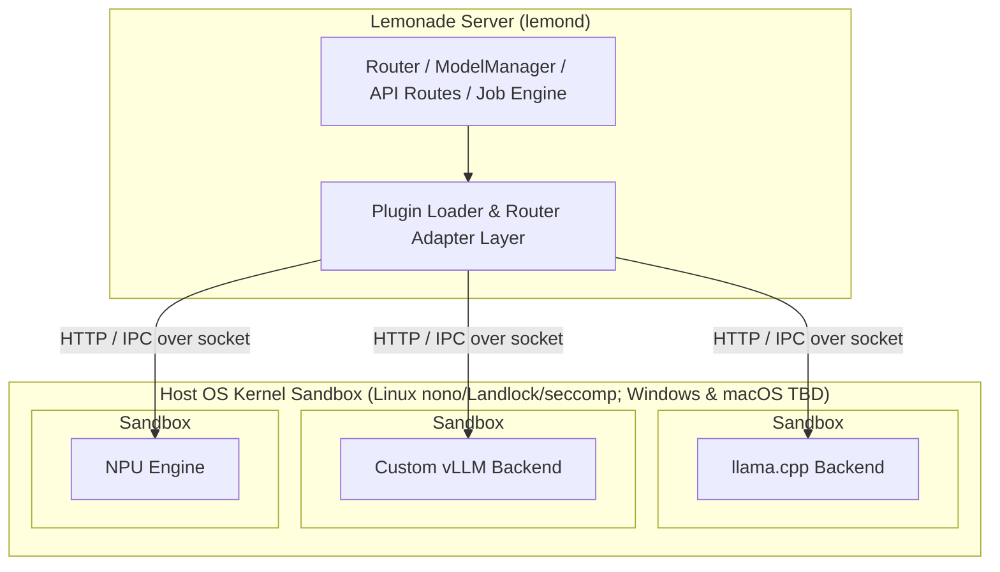

# Working Group: Backend Plugins & Sandboxing

## Overview

**Lead:** This working group is led by Arun Babu Neelicattu, whose handle is @abn on GitHub and @abn.null on Discord.

**Background:** Lemonade runs inference by spawning backends as subprocesses (`llama-server`, `whisper-server`, `sd-server`, `flm`, `vllm`). Currently, adding a backend requires modifying C++ server sources and recompiling `lemond`. This limits Lemonade to in-tree backends and slows adoption of new inference engines.

Running third-party or community backend binaries introduces security risks (unauthorized file access, network egress, privilege escalation). Experimentation with `nono.sh` demonstrated that backend subprocesses can be restricted to least-privilege filesystem and network boundaries without impacting inference performance.

**Why:** Enables adding third-party backends without C++ code modifications while securing backend subprocesses with OS kernel sandboxing.

**Goal:** Enable `lemond` to orchestrate out-of-tree backends under kernel sandboxing by default, supported by a recipe marketplace and CLI/GUI management tooling.

---

## Scope

### In Scope

- **Plugin Manifest & Runtime Protocol:** Declarative JSON backend descriptor and standardized HTTP/socket runtime interface.
- **Process Sandboxing (`nono`):** Subprocess isolation for binary backends using Landlock, seccomp-bpf, and OS kernel primitives.
- **Permission Policy Model:** Descriptor privilege declarations (filesystem paths, device nodes, network egress) enforced at process launch.
- **Backend Recipe Marketplace:** Git-backed registry for publishing, fetching, and installing backend descriptors and default model recipes.
- **Client Interfaces:** CLI (`lemonade backends`) and GUI (Tauri / Web app) tooling for plugin management, marketplace browsing, and sandbox policy review.

### Out of Scope

- **Engine Binary Provisioning:** Lemonade does not build or fetch engine binaries. Descriptors reference executables already installed on the host (or container images managed by `podman`/`docker`).
- **Deep Container Engine Integration:** Full container lifecycle management, OCI registry orchestration, and container sandboxing wrappers (`gVisor`, container-wrapped `nono`). Recommended for a dedicated follow-on working group.
- **In-Process Dynamic Libraries:** Backends run exclusively as external subprocesses to preserve crash isolation and sandboxing guarantees.

---

## Architecture & Concepts

### 1. Backend Plugin Specification

Backends transition from statically linked C++ `WrappedServer` classes to declarative JSON descriptors.

- **Descriptor Schema:** Declares metadata, capability interfaces (`ICompletionServer`, `ITranscriptionServer`, etc.), a `Host OS × Accelerator` compatibility matrix, launcher command templates, and default recipe mappings.
- **Interface Contract:** Standardized health checks, load/unload lifecycle endpoints, and API passthrough.
- **Slot Policies:** Declarative slot management (`standard`, `exclusive_npu`, `coexist_by_type`, `unmetered`) mapping directly to `lemon::SlotPolicy` enum values enforced by the Router.
- **Platform Matrix:** Platform blocks are keyed by OS first, then device accelerator. Registration validates that at least one platform block matches the host OS before registering the backend. *(Note: A container recipe's platform block describes its guest OS; GPU containers target `linux`, which Windows hosts satisfy via WSL2).*

### 2. Permission Model & Sandboxing

Backend subprocesses run inside an OS kernel sandbox where available (Linux `nono` via Landlock/seccomp; Windows AppContainer/Job Objects and macOS Seatbelt are planned cross-platform enforcement milestones).

- **Least Privilege:** Read-only access to model weights and install paths; read-write access restricted to scratch/log directories.
- **Device & Network Control:** Device nodes (`/dev/dri/*`, `/dev/kfd`, NPU nodes) and outbound network egress must be explicitly declared in the descriptor.
- **Consent vs Enforcement:** The descriptor's declared policy is shown to the user during installation (consent review). Enforcement is applied at process launch by the kernel sandbox (`nono`). Container recipes operate under container runtime permissions.
- **Enforcement Modes:** Configurable via `config.json` (`auto`, `enabled`, `disabled`), defaulting to `auto`.

### 3. Backend Recipe Marketplace

A mechanism to discover and install backend descriptors and default recipes.

- **Git-Backed Index:** Marketplaces are Git repositories addressed as `org/repo[/subdir]` (GitHub REST API-first, requiring no local `git` CLI).
- **Pinned & Idempotent:** Installation pins to a repository git ref and verifies a SHA-256 content hash of the fetched descriptor. Updates require explicit re-installation.
- **No Binaries:** Marketplaces distribute plain JSON descriptors and recipe configurations, never executable binaries or model weights.

### 4. Client Interfaces (CLI & GUI)

- **CLI Commands:**
  - `lemonade backends` — List installed and running backends, slot status, and sandbox state.
  - `lemonade backends install <path|repo/recipe>` — Install a local descriptor file (`<path>`) or fetch and install a remote marketplace recipe (`<repo/recipe>`).
  - `lemonade backends uninstall <name>` — Unregister and remove an installed backend recipe.
  - `lemonade backends sandbox status` — View active sandbox profiles and enforcement modes.
- **GUI:**
  - Marketplace browser in the Tauri Desktop App and Web App.
  - Permission consent dialog displaying declared paths, device nodes, and network access before enabling a third-party backend.
  - Per-backend sandbox status and resource usage indicators.

---

## Roadmap & Milestones

> Sequential high-level phases; RFCs refine specifics.

### Phase 1: Plugin Specification & External Adapter Architecture

- [ ] RFC for the **Backend Plugin Specification** (descriptor schema, OS × device matrix, capability mapping, lifecycle).
- [ ] `ExternalBackendServer` class in `lemond` wrapping out-of-process backends via HTTP/sockets while honoring `WrappedServer` interfaces.
- [ ] `ModelManager` / `Router` discovery and validation of local descriptor files in `backends/` directories.
- [ ] `lemonade backends` CLI commands (`backends`, `backends install <path>`, `backends uninstall <name>`).
- [ ] Registration-time host-OS compatibility validation.

### Phase 2: Process Sandboxing Core (`nono`) & Permission Policy Engine

- [ ] RFC for the **Sandbox Architecture & Permission Policy Schema**.
- [ ] `NonoSandbox` engine for binary backend subprocesses (Linux Landlock filesystem restrictions, seccomp-bpf system call filtering, device node rules).
- [ ] Cross-platform binary process sandboxing (Windows AppContainer / Job Objects; macOS Seatbelt / App Sandbox).
- [ ] Permission manifest parser and configurable enforcement modes (`auto`, `enabled`, `disabled`) in `lemond`.
- [ ] Sandbox telemetry in `/system-info` and `lemonade backends sandbox status`.
- [ ] **Extension Evaluation:** Evaluate container backend security posture (container runtime isolation vs. rootless Podman namespaces vs. `nono` container profile wrappers). Determines hand-off to proposed Containerized Backends WG.

### Phase 3: Marketplace Infrastructure & Recipe Sharing

- [ ] RFC and schema for the **Recipe Marketplace Registry** (GitHub `org/repo[/subdir]` index, ref + SHA-256 content-hash pinning, descriptor validation).
- [ ] API-first fetching mechanism (GitHub REST API) without local `git` binary dependencies.
- [ ] CLI marketplace command (`lemonade backends install <repo/recipe>`).
- [ ] Content-hash verification and permission consent flow during marketplace installation.
- [ ] Community recipe publishing guide.

### Phase 4: GUI, Hardening & Ecosystem

- [ ] Backend manager and marketplace UI in Tauri and Web apps.
- [ ] Permission consent modal in GUI displaying declared paths, devices, and network permissions.
- [ ] Sandbox status indicators per running backend.
- [ ] Port a built-in backend to descriptor format to validate the plugin architecture.
- [ ] CI regression suite verifying kernel sandbox enforcement.
- [ ] Developer guide: *Building, Publishing, and Using a Lemonade Backend Recipe*.

---

## Governance & Communication

- **Discord Channel:** `#wg-backend-plugins`
- **GitHub Label:** `wg-backend-plugins`
- **Meeting Cadence:** Bi-weekly working group sync (published on Discord).
- **PR Review:** Proposals for specifications, sandbox policies, or marketplace schemas require approval from the Working Group Lead and a core maintainer.
