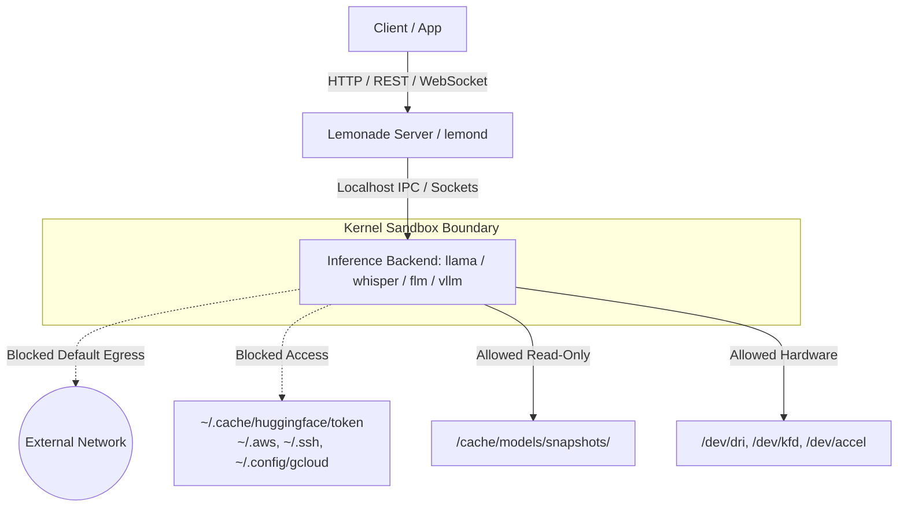

# Process Sandboxing & Security

Lemonade isolates backend inference subprocesses (`llama-server`, `whisper-server`, `sd-server`, `flm`, `vllm`, etc.) using kernel-level process sandboxing and ambient credential scrubbing. This protects host systems from unauthorized filesystem modifications, prevents accidental credential exposure, and ensures untrusted or community models cannot make unexpected outbound network connections.

---

## Security Architecture

Backend inference engines run as dedicated child subprocesses. Rather than executing with full user privileges, each backend process is launched inside a least-privilege sandbox tailored specifically to its runtime requirements.



---

## Core Security Invariants

### 1. Default-Deny Outbound Network Egress
By default, backend inference processes cannot initiate outbound connections to external IP addresses or domain names. Backends only bind to assigned local loopback ports (`127.0.0.1:<port>`) to communicate with the `lemond` router.

### 2. Snapshot & Checkpoint Isolation
Model weights are mounted read-only from specific snapshot directories (e.g. `~/.cache/huggingface/hub/models--.../snapshots/<hash>/`). Parent directories containing sensitive credentials (such as `~/.cache/huggingface/token` or `~/.modelscope/token`) are blocked.

### 3. Ambient Secret Scrubbing
Before spawning any backend subprocess, Lemonade scrubs ambient environment variables:
* `LEMONADE_*` admin API keys and internal credentials are stripped.
* Cloud provider API keys (`OPENAI_API_KEY`, `ANTHROPIC_API_KEY`, `AWS_SECRET_ACCESS_KEY`, etc.) are stripped.
* System and VCS tokens (`GITHUB_TOKEN`, `GITLAB_TOKEN`, `SSH_AUTH_SOCK`, etc.) are removed.
* Only essential runtime execution variables (such as `PATH`, `LD_LIBRARY_PATH`, `CUDA_VISIBLE_DEVICES`, `HIP_VISIBLE_DEVICES`) are passed through.

---

## Operating Modes

Lemonade supports five configurable sandbox operating modes:

| Mode | Behavior | Use Case |
| :--- | :--- | :--- |
| `auto` (default) | Enforces kernel sandboxing if supported on the host; falls back to ambient secret scrubbing on unsupported platforms. | Standard desktop and server deployments. |
| `enforced` | Requires full kernel sandboxing. If kernel sandboxing fails or is unavailable on the platform, process launch is aborted with an error. | High-security, enterprise, or multi-tenant deployments. |
| `scrubbed_only` | Applies ambient credential scrubbing without applying kernel sandboxing rules. | Debugging native runtime issues or running on legacy OS kernels. |
| `disabled` | Bypasses kernel sandboxing and passes standard environment variables. | Advanced troubleshooting or local development. |
| `learn` | Runs with full access and logs required files, devices, and variables to assist in writing capability policies. | Onboarding new experimental backends. |

---

## Platform Support & Mechanisms

Lemonade translates policies to native platform primitives:

=== "Linux"
    * **Mechanism**: Linux Landlock LSM + Seccomp BPF filters.
    * **Filesystem**: Read-only access to system dynamic loader libraries (`/usr/lib`, `/lib64`), driver paths (`/opt/rocm`, `/opt/cuda`), and the model snapshot subtree.
    * **Devices**: Access to GPU (`/dev/dri`, `/dev/kfd`, `/dev/nvidia*`) and NPU (`/dev/accel*`, `/dev/amdxdna*`) device nodes.
    * **Network**: Default-deny outbound egress with loopback port allowance.

=== "macOS"
    * **Mechanism**: Apple Seatbelt (`sandbox_init`).
    * **Filesystem**: Positive allowlisting of system libraries (`/System/Library`, `/usr/lib`) and model weight files.
    * **Hardware**: Access to Metal / IOKit frameworks and Mach service registries.
    * **Network**: Loopback socket allowance with external network egress denial.

=== "Windows"
    * **Mechanism**: Win32 AppContainer isolation + Process Mitigation Policies + Job Objects.
    * **Filesystem**: Zero-privilege default NTFS ACLs with transient Access Control Entries (ACEs) granted exclusively for designated model and executable folders.
    * **Hardware**: Access to Direct3D, DirectML, and DXGI driver devices.
    * **Process Control**: Bound to Windows Job Objects with `JOB_OBJECT_LIMIT_KILL_ON_JOB_CLOSE`.

---

## Configuration

You can configure sandboxing using the CLI or directly via `config.json`.

### Configuration via CLI

View current configuration:
```bash
lemonade config
```

Set the sandbox mode:
```bash
lemonade config set sandbox=enforced
```

### Configuration via `config.json`

Set the `sandbox` key in your `config.json`:

```json
{
  "sandbox": "auto"
}
```

> [!NOTE]
> You can also temporarily override the sandbox mode for a single run using the environment variable:
> ```bash
> LEMONADE_SANDBOX_MODE=enforced lemond
> ```

---

## Declarative Model Recipe Overrides

If a custom model requires companion weights (such as speculative draft models, vision projectors, or custom cache folders), you can declare them directly in the model recipe JSON without changing server code:

```json
{
  "recipe": "llamacpp",
  "sandbox": {
    "path_grants": [
      {
        "path": "/opt/lemonade/models/mmproj-model.gguf",
        "write_allowed": false
      }
    ],
    "allowed_env_vars": [
      "CUSTOM_BACKEND_FLAG"
    ]
  }
}
```

---

## Audit & Troubleshooting

When troubleshooting backend launches, Lemonade logs the full calculated capability policy before spawning:

1. Enable debug logging:
   ```bash
   lemonade config set log_level=debug
   ```
2. Inspect the server logs to view the evaluated sandbox policy:
   ```text
   [DEBUG] [WrappedServer] Enforcing sandbox policy for 'llama-server':
   SandboxPolicy {
     mode: auto
     network: loopback_only (bind_port: 13306)
     path_grants (4):
       [RO] /usr/lib
       [RO] /opt/rocm
       [RO] /cache/models/snapshots/8a1b2c/model.gguf
       [RW] /tmp
     devices: [/dev/dri, /dev/kfd]
     allowed_env: [PATH, LD_LIBRARY_PATH, CUDA_VISIBLE_DEVICES, HIP_VISIBLE_DEVICES]
   }
   ```
