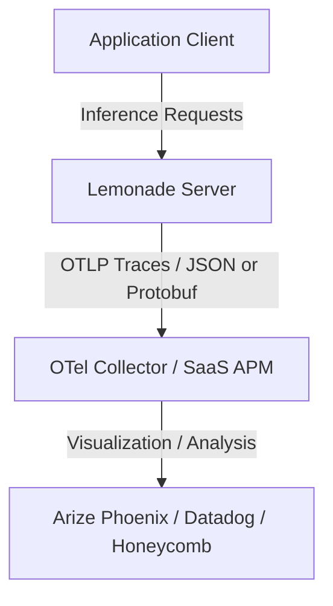

# Telemetry Guide

Lemonade provides a unified, zero-dependency OpenTelemetry (OTLP) telemetry subsystem designed to trace inference requests and export metrics. This allows developers, prompt engineers, and system administrators to monitor token usage, latencies, request context, and scheduler performance.

---

## Architecture & Concepts

Lemonade exports trace spans directly to any OpenTelemetry-compatible collector or application performance monitor (APM) using the OTLP wire protocol.



### Supported Semantic Conventions

Lemonade supports two co-existing trace formats:

1. **OpenInference (`openinference.*`)**:
   - A mature convention designed specifically for LLM and agentic application tracing.
   - Deeply integrated into AI evaluation suites (e.g., **Arize Phoenix**, **Langfuse**).
   - Captures rich LLM attributes (such as `llm.token_count.prompt`, `llm.token_count.completion`, and raw inputs/outputs/thinking).
2. **OpenTelemetry GenAI (`gen_ai.*`)**:
   - The official, vendor-neutral standard defined by the OpenTelemetry community.
   - Supported by mainstream APM backends (e.g., **Honeycomb**, **Datadog**, **Grafana**).
   - Captures standardized attributes (such as `gen_ai.system`, `gen_ai.request.model`, and `gen_ai.usage.input_tokens`).

Users can specify one or both formats. When both are enabled, Lemonade packs attributes for both conventions into a **single pass** and exports them in a **single network payload** to eliminate network overhead.

---

## Distributed Tracing (W3C Trace Context)

By default, each inference request starts its own root trace. When a caller is itself an instrumented application (e.g. a multi-agent orchestrator), you can have Lemonade's spans join the caller's trace instead, so an entire multi-step workflow appears as one connected tree.

Set `telemetry.trust_incoming_trace_context=true` to opt in. Lemonade then reads the standard [W3C `traceparent`](https://www.w3.org/TR/trace-context/) header on incoming requests: the request's span adopts the header's trace id and is parented to the header's span id. Requests without a valid `traceparent`, or received while the setting is `false`, keep the default root-span behavior.

```bash
lemonade config set telemetry.enabled=true \
                    telemetry.trust_incoming_trace_context=true
```

The caller supplies the header on each request, for example:

```bash
curl http://localhost:13305/api/v1/chat/completions \
  -H "Content-Type: application/json" \
  -H "traceparent: 00-4bf92f3577b34da6a3ce929d0e0e4736-00f067aa0ba902b7-01" \
  -d '{"model": "...", "messages": [{"role": "user", "content": "Hello"}]}'
```

The setting is opt-in because it makes span parentage depend on client-supplied input; leave it disabled unless you trust the callers on your network.

---

## Configuration

Telemetry is configured under the `telemetry` block in your `config.json` or managed dynamically via the Lemonade CLI/API.

### Settings Reference

| Key | Type | Default | Description |
|-----|------|---------|-------------|
| `telemetry.enabled` | boolean | `false` | Set to `true` to enable tracing. |
| `telemetry.hide_inputs` | boolean | `false` | Redacts raw prompt inputs from trace attributes to protect privacy. |
| `telemetry.hide_outputs` | boolean | `false` | Redacts assistant output text from trace attributes. |
| `telemetry.hide_thinking` | boolean | `false` | Redacts internal reasoning/thinking blocks from trace attributes. |
| `telemetry.trust_incoming_trace_context` | boolean | `false` | When `true`, honor a caller-supplied W3C `traceparent` header so inference spans join the caller's distributed trace. See [Distributed Tracing](#distributed-tracing-w3c-trace-context). |
| `telemetry.max_queue_capacity` | int | `1000` | Target memory buffer capacity for queued spans. When exceeded, the oldest spans are evicted first (FIFO). |
| `telemetry.otlp.endpoint` | string | `"http://localhost:4318/v1/traces"` | OTLP HTTP receiver endpoint URL. |
| `telemetry.otlp.protocol` | string | `"http/protobuf"` | Encoding protocol: `"http/protobuf"` or `"http/json"`. |
| `telemetry.otlp.semantics` | array | `["openinference", "otel_genai"]` | Enabled conventions. Supported: `"openinference"`, `"otel_genai"`. |
| `telemetry.otlp.headers` | object | `{}` | Key-value pairs for HTTP request headers (e.g., authorization API keys). |
| `telemetry.otlp.max_retries` | int | `0` | Max export retry attempts for transient server errors. Set to `0` to disable retries. |
| `telemetry.otlp.retry_backoff_base_s` | double | `5.0` | Base exponential backoff delay in seconds. |
| `telemetry.otlp.send_batch_size` | int | `100` | Target span batch size to dispatch in a single HTTP request. |
| `telemetry.otlp.batch_timeout_s` | double | `1.0` | Max buffer timeout in seconds before exporting a partial batch. |

---

## Dynamic Control via CLI & API

You can toggle telemetry dynamically while the server is running without restarting.

### Via Lemonade CLI

```bash
# Enable telemetry
lemonade telemetry on

# Disable telemetry
lemonade telemetry off

# View current configuration
lemonade config
```

### Via Configuration API

Internal configuration is updated via the `/internal/set` endpoint:

```bash
# Enable telemetry and select only OpenTelemetry GenAI semantics
curl -X POST http://localhost:13305/internal/set \
  -H "Content-Type: application/json" \
  -d '{
    "telemetry": {
      "enabled": true,
      "otlp": {
        "semantics": ["otel_genai"]
      }
    }
  }'
```

### Forcing a Flush

Spans are buffered in memory to optimize networking. You can force-flush the telemetry queue at any time:

```bash
curl -X POST http://localhost:13305/internal/telemetry/flush
```

---

## Integration Guides

### 1. Local LLM Observability with Arize Phoenix

[Arize Phoenix](https://phoenix.arize.com/) is an open-source AI observability platform that runs locally. It consumes the `openinference` format.

#### Quick Start with Podman

To run Arize Phoenix in the foreground (interactive mode, automatically removed on exit):
```bash
podman run --rm -it --name phoenix \
  -p 6006:6006 -p 4317:4317 -p 4318:4318 \
  docker.io/arizeai/phoenix:latest
```

Alternatively, to run it in the background (detached mode):
```bash
podman run -d --name phoenix \
  -p 6006:6006 -p 4317:4317 -p 4318:4318 \
  docker.io/arizeai/phoenix:latest
```

Once running, configure Lemonade to point to the local Phoenix OTLP endpoint:
```bash
lemonade config set telemetry.enabled=true \
                    telemetry.otlp.endpoint=http://localhost:4318/v1/traces \
                    telemetry.otlp.semantics='["openinference"]'
```
Navigate to `http://localhost:6006` in your browser to inspect trace flows.

---

### 2. Cloud Observability (SaaS APM)

If you use a cloud-hosted observability provider (such as Honeycomb, Datadog, or New Relic), you can configure Lemonade to stream trace data directly over HTTPS without running local collectors.

#### Example: Direct-to-Honeycomb

To send trace details to Honeycomb (using `otel_genai` semantics):

```bash
lemonade config set telemetry.enabled=true \
                    telemetry.otlp.endpoint=https://api.honeycomb.io/v1/traces \
                    telemetry.otlp.semantics='["otel_genai"]' \
                    telemetry.otlp.headers='{"x-honeycomb-team": "YOUR_API_KEY"}'
```

---

## Privacy & Redaction

By default, Lemonade captures prompts, completions, and reasoning content in span attributes to allow full evaluation and debugging.

If you are running in a privacy-sensitive environment, redact this content from outgoing telemetry payloads:

```bash
# Redact inputs, outputs, and reasoning steps
lemonade config set telemetry.hide_inputs=true \
                    telemetry.hide_outputs=true \
                    telemetry.hide_thinking=true
```

When redacted, metadata (tokens, latency, model names, status codes) is still reported, but the actual text payloads are replaced with empty values.
